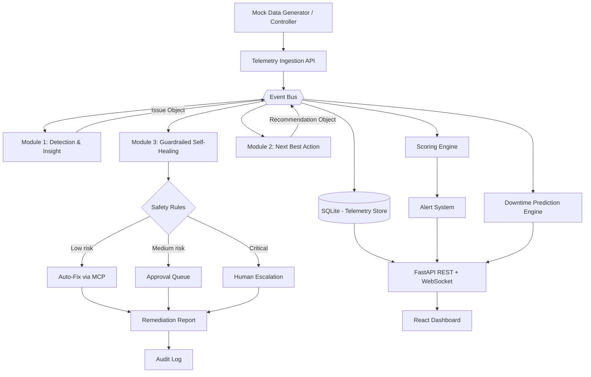
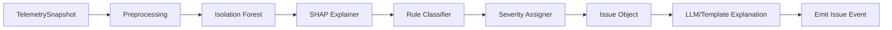
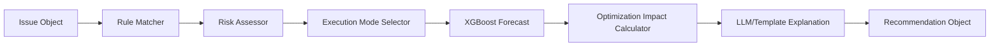
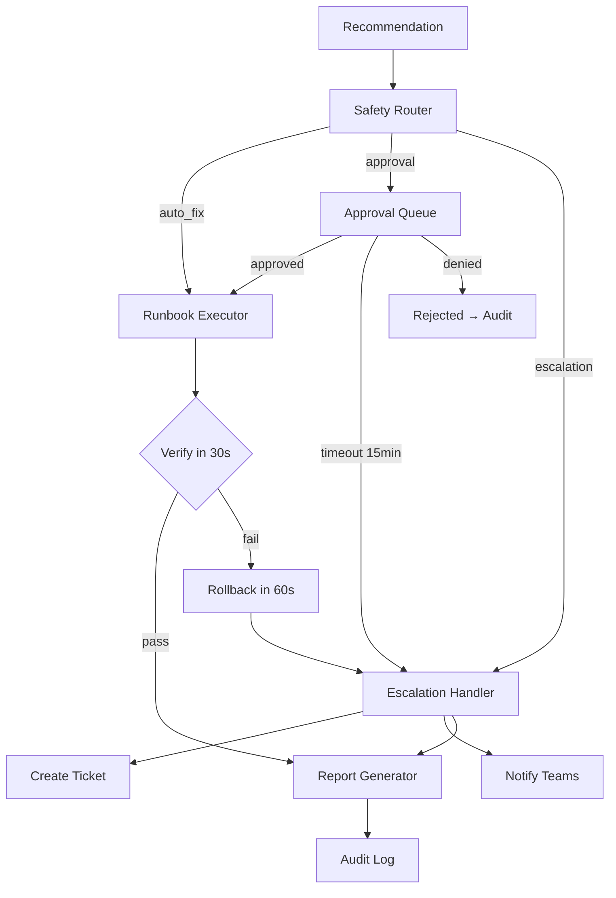

# Design Document: Clover Cloud Intelligence Platform

## Overview

Clover is a cloud intelligence platform for construction-tech that continuously monitors workloads, detects anomalies using ML and rules, explains findings with explainable AI, recommends next-best-actions with projected cost/energy/carbon forecasts, and safely remediates through a guardrailed self-healing pipeline.

The system follows a three-stage pipeline architecture:

```
Detection & Insight → Next Best Action → Guardrailed Self-Healing
```

Cross-cutting engines (Scoring, Alerts, Downtime Prediction, Audit) feed into and out of this pipeline. All data flows through an event bus within a single FastAPI process with background tasks. The frontend is a React 18 + TypeScript dashboard communicating via REST and WebSocket APIs.

**Key Design Decisions:**
- Single-process MVP with asyncio event bus for module decoupling
- Policy-as-data: all rules, weights, and runbooks are JSON config files
- Simulation-first: all cloud operations are simulated MCP connectors
- LLM never makes safety or action decisions (rules are authoritative)
- Dual heatmap (composite + matrix) as the primary dashboard view

---

## Architecture

### System Diagram



### Module Boundaries

| Layer | Responsibility | Technology |
|-------|---------------|------------|
| Ingestion | Validate telemetry, persist, emit events | FastAPI endpoint + Pydantic |
| Module 1 - Detection | Isolation Forest + SHAP + rules + LLM explanation | scikit-learn, SHAP, rule engine |
| Module 2 - NBA | Rule-based recommendations + XGBoost forecast | XGBoost, JSON rules |
| Module 3 - Self-Healing | Safety routing + MCP execution + verify/rollback | Rule engine, simulated connectors |
| Scoring Engine | Priority Score (6-factor) + Dimension Scores | Weighted formula |
| Alert System | Threshold alerts + suppression + auto-resolve | Event-driven |
| Downtime Prediction | Failure probability + timeline + preemptive actions | Trend analysis |
| Storage | Persist all entities, config, audit trail | SQLite + JSON files |
| API Layer | REST endpoints + WebSocket streaming | FastAPI |
| Frontend | Dashboard, heatmaps, workflow pages | React 18 + TypeScript + Vite |

### Event Bus Design

The internal event bus uses Python `asyncio.Queue` instances with a pub/sub pattern:

```python
# Event types
class EventType(str, Enum):
    TELEMETRY_INGESTED = "telemetry_ingested"
    ISSUE_DETECTED = "issue_detected"
    RECOMMENDATION_GENERATED = "recommendation_generated"
    REMEDIATION_COMPLETED = "remediation_completed"
    SCORE_UPDATED = "score_updated"
    ALERT_FIRED = "alert_fired"
    PREDICTION_UPDATED = "prediction_updated"

@dataclass
class Event:
    event_type: EventType
    payload: dict
    timestamp: datetime
    correlation_id: str
```

Subscribers register handlers per event type. The bus dispatches asynchronously via `asyncio.create_task`, allowing modules to react without blocking the pipeline.

---

## Components and Interfaces

### Backend Module Structure

```
backend/
├── main.py                          # FastAPI app entry, lifespan, CORS
├── api/
│   ├── telemetry.py                 # POST /api/telemetry/ingest, bulk-ingest
│   ├── workloads.py                 # GET workloads, detail, telemetry history
│   ├── detection.py                 # POST run detection, GET issues
│   ├── recommendations.py          # POST generate, GET detail, forecast
│   ├── remediation.py              # POST evaluate/execute, GET report
│   ├── approvals.py                # GET queue, POST approve/deny/snooze
│   ├── scoring.py                  # GET scored issues
│   ├── alerts.py                   # GET alerts
│   ├── audit.py                    # GET audit logs
│   ├── dashboard.py                # GET summary, heatmaps, savings
│   ├── mock_controller.py          # GET scenarios, POST trigger/reset/stream
│   └── websocket.py                # WS /ws/events
├── modules/
│   ├── detection_insight/
│   │   ├── detector.py             # Orchestrates detection pipeline
│   │   ├── isolation_forest.py     # ML anomaly detection
│   │   ├── shap_explainer.py       # SHAP feature contributions
│   │   ├── rule_classifier.py      # Rule-based issue classification
│   │   ├── severity_assigner.py    # Severity logic
│   │   └── llm_explainer.py        # LLM/template explanation generator
│   ├── next_best_action/
│   │   ├── nba_engine.py           # Rule-based recommendation engine
│   │   ├── xgboost_forecast.py     # XGBoost 30-day forecaster
│   │   ├── optimization_impact.py  # Before/after/savings calculator
│   │   └── risk_assessor.py        # Risk level + execution mode
│   ├── self_healing/
│   │   ├── safety_router.py        # Safety rules → path decision
│   │   ├── runbook_executor.py     # Runbook step execution
│   │   ├── verification.py         # Post-fix verification (30s timeout)
│   │   ├── rollback.py             # Rollback handler (60s timeout)
│   │   ├── approval_queue.py       # Queue management + escalation timers
│   │   └── report_generator.py     # Remediation report builder
│   ├── scoring/
│   │   ├── priority_scorer.py      # 6-factor weighted score
│   │   └── dimension_scorer.py     # Per-dimension 0-100 + state
│   ├── alerts/
│   │   ├── alert_engine.py         # Threshold checking + generation
│   │   ├── suppression.py          # Duplicate suppression (15-min window)
│   │   └── delivery.py             # Delivery + retry + auto-resolve
│   └── downtime_prediction/
│       ├── predictor.py            # Failure probability + TTF
│       └── timeline.py             # 12-point risk timeline
├── connectors/
│   ├── mcp_base.py                 # Base MCP connector interface
│   ├── cloud_connector.py          # Simulated cloud ops
│   ├── ticketing_connector.py      # Simulated ticketing
│   ├── notification_connector.py   # Simulated notifications
│   └── audit_connector.py          # Audit log writer
├── core/
│   ├── event_bus.py                # Async pub/sub event bus
│   ├── config.py                   # Config loader (JSON policies)
│   └── database.py                 # SQLite connection + migrations
├── schemas/
│   ├── workload.py                 # Pydantic models for Workload
│   ├── telemetry.py                # TelemetrySnapshot schema
│   ├── issue.py                    # Issue schema
│   ├── recommendation.py          # Recommendation schema
│   ├── remediation.py             # Remediation schema
│   ├── scoring.py                  # PriorityScore, DimensionScores
│   ├── alert.py                    # Alert schema
│   ├── audit.py                    # AuditLog schema
│   ├── prediction.py              # DowntimePrediction schema
│   └── api_responses.py           # Envelope wrappers
├── services/
│   ├── workload_service.py        # Workload CRUD
│   ├── telemetry_service.py       # Telemetry persistence + query
│   ├── issue_service.py           # Issue CRUD + filtering
│   └── mock_data_service.py       # Mock generator + scenarios
├── rules/
│   ├── detection_rules.json       # Detection thresholds
│   ├── recommendation_rules.json  # NBA rule table
│   ├── safety_rules.json          # Self-healing safety policy
│   └── scoring_weights.json       # Priority score weights
├── mock_data/
│   ├── sample_workloads.json      # 8-20 workload definitions
│   ├── healthy_baseline.json      # Healthy telemetry per workload
│   ├── scenario_payloads.json     # Per-scenario telemetry injections
│   └── training_data.csv          # Historical data for XGBoost
└── ml/
    ├── train_isolation_forest.py  # Training script
    ├── train_xgboost.py           # Training script
    └── models/                    # Serialized model files (.joblib)
```

### Frontend Component Structure

```
frontend/
├── src/
│   ├── App.tsx                     # Router + layout
│   ├── main.tsx                    # Entry point
│   ├── index.css                   # Tailwind base
│   ├── types/
│   │   ├── workload.ts            # Workload, TelemetrySnapshot
│   │   ├── issue.ts               # Issue, XAIExplanation
│   │   ├── recommendation.ts     # Recommendation, OptimizationForecast
│   │   ├── remediation.ts        # Remediation, Report
│   │   ├── scoring.ts            # PriorityScore, DimensionScores
│   │   ├── alert.ts              # Alert
│   │   ├── audit.ts              # AuditLog
│   │   └── api.ts                # API envelope types
│   ├── api/
│   │   ├── client.ts             # Axios/fetch wrapper
│   │   ├── websocket.ts          # WebSocket manager + reconnect
│   │   └── endpoints.ts          # Typed API functions
│   ├── hooks/
│   │   ├── useWebSocket.ts       # WS connection + event dispatch
│   │   ├── useWorkloads.ts       # Workload data fetching
│   │   ├── useIssues.ts          # Issues data + filters
│   │   └── useRealtime.ts        # Real-time state updates
│   ├── pages/
│   │   ├── Dashboard.tsx          # Heatmap landing (composite + matrix)
│   │   ├── Workloads.tsx          # Workload list
│   │   ├── WorkloadDetail.tsx     # Tabbed detail (Overview/Security/GreenOps/AI/Healing/MCP)
│   │   ├── Issues.tsx             # Issues list + filters
│   │   ├── IssueDetail.tsx        # XAI card + forecast + action CTA
│   │   ├── Approvals.tsx          # Approval queue
│   │   ├── Reports.tsx            # Remediation reports list
│   │   ├── AuditLogs.tsx          # Audit log table
│   │   └── MockController.tsx     # Scenario triggers + stream control
│   ├── components/
│   │   ├── layout/
│   │   │   ├── Header.tsx         # Nav + pending-approvals badge
│   │   │   ├── Sidebar.tsx        # Navigation menu
│   │   │   └── SimBanner.tsx      # "Simulation Mode" banner
│   │   ├── heatmap/
│   │   │   ├── CompositeGrid.tsx  # Priority score gradient grid
│   │   │   ├── MatrixView.tsx     # Dimension matrix (6 cols)
│   │   │   ├── HeatmapCell.tsx    # Individual cell + tooltip
│   │   │   └── HeatmapToggle.tsx  # Composite ↔ Matrix switch
│   │   ├── charts/
│   │   │   ├── RiskTimeline.tsx   # 12-point downtime timeline
│   │   │   ├── UptimeBar.tsx      # 90-day uptime segments
│   │   │   ├── ForecastChart.tsx  # Before/after/savings bars
│   │   │   └── SavingsBadge.tsx   # Projected savings callout
│   │   ├── cards/
│   │   │   ├── XAICard.tsx        # SHAP top factors table
│   │   │   ├── OptimizationForecast.tsx  # Cost/energy/carbon comparison
│   │   │   ├── DowntimePrediction.tsx    # Probability + TTF + signals
│   │   │   ├── SummaryCards.tsx   # Dashboard stat cards
│   │   │   └── AlertCard.tsx      # Alert display
│   │   ├── workflow/
│   │   │   ├── ApprovalItem.tsx   # Single approval queue item
│   │   │   ├── EscalationTimer.tsx # Countdown display
│   │   │   ├── RemediationReport.tsx # Full report view
│   │   │   └── ExecutionPath.tsx  # Auto/Approval/Escalation indicator
│   │   └── ui/
│   │       ├── Badge.tsx          # Severity/status badges
│   │       ├── DataTable.tsx      # Sortable/filterable table
│   │       ├── Tooltip.tsx        # Hover tooltip
│   │       ├── Modal.tsx          # Confirmation modals
│   │       └── StaleIndicator.tsx # "Data stale" warning
│   └── lib/
│       ├── colorScale.ts          # Priority score → gradient color
│       ├── formatters.ts          # Date, currency, percentage formatters
│       └── constants.ts           # API URLs, thresholds
├── package.json
├── tsconfig.json
├── vite.config.ts
├── tailwind.config.ts
└── postcss.config.js
```

### Key Interfaces

```python
# Module 1 interface
class DetectionEngine(Protocol):
    async def detect(self, telemetry: TelemetrySnapshot) -> Issue: ...

# Module 2 interface
class NBAEngine(Protocol):
    async def recommend(self, issue: Issue) -> Recommendation: ...

# Module 3 interface
class SelfHealingEngine(Protocol):
    async def evaluate_and_execute(self, recommendation: Recommendation) -> RemediationResult: ...

# MCP Connector interface
class MCPConnector(Protocol):
    async def execute_tool(self, tool_name: str, params: dict) -> MCPToolResult: ...
    def get_available_tools(self) -> list[MCPToolDefinition]: ...

# Scoring interface
class ScoringEngine(Protocol):
    def compute_priority_score(self, workload: Workload, issues: list[Issue]) -> PriorityScore: ...
    def compute_dimension_scores(self, workload: Workload, telemetry: TelemetrySnapshot) -> DimensionScores: ...
```

---

## Data Models

### Workload

```python
class Workload(BaseModel):
    workload_id: str                                    # e.g. "wl-bim-processor-001"
    workload_name: str
    workload_type: str                                  # Business type
    cloud_service_type: Literal["vm", "container", "database", "storage", "serverless", "pipeline"]
    environment: Literal["production", "staging", "testing", "development"]
    region: str
    owner_team: str
    construction_workflow: str                           # One of 9 predefined workflows
    workflow_criticality: Literal["critical", "high", "medium", "low"]
    status: Literal["healthy", "warning", "critical", "unreachable"]
```

### TelemetrySnapshot

```python
class TelemetrySnapshot(BaseModel):
    workload_id: str
    cpu_usage_percent: float = Field(ge=0, le=100)
    memory_usage_percent: float = Field(ge=0, le=100)
    storage_gb: float = Field(ge=0)
    runtime_hours_24h: float = Field(ge=0)
    request_count_24h: int = Field(ge=0)
    error_rate_percent: float = Field(ge=0, le=100)
    latency_ms: float = Field(ge=0)
    public_exposure: bool
    public_storage: bool
    vulnerability_severity: Literal["none", "low", "medium", "high", "critical"]
    critical_vulnerability_count: int = Field(ge=0)
    access_anomaly_detected: bool
    monitoring_enabled: bool
    cost_per_hour: float = Field(ge=0, le=999999.99)
    cost_24h: float = Field(ge=0, le=999999.99)
    cost_30d_forecast: float = Field(ge=0, le=999999.99)
    energy_kwh_24h: float = Field(ge=0)
    carbon_kgco2e_24h: float = Field(ge=0)
    carbon_intensity_gco2_per_kwh: float = Field(ge=0)
    timestamp: datetime
```

### Issue

```python
class MLResult(BaseModel):
    model_name: str                                     # "Isolation Forest" or fallback name
    anomaly_score: float
    is_anomaly: bool

class XAIFactor(BaseModel):
    feature: str
    value: float | str
    impact: str                                         # Plain-language impact description

class XAIExplanation(BaseModel):
    method: str                                         # "SHAP-style feature contribution"
    top_contributing_factors: list[XAIFactor]

class EstimatedImpact(BaseModel):
    cost_risk: Literal["low", "medium", "high"]
    energy_risk: Literal["low", "medium", "high"]
    carbon_risk: Literal["low", "medium", "high"]
    security_risk: Literal["low", "medium", "high"]
    workflow_disruption_risk: Literal["low", "medium", "high"]

class Issue(BaseModel):
    issue_id: str
    workload_id: str
    issue_type: str                                     # One of 7+ defined types
    issue_category: Literal["security", "cost", "energy", "carbon", "performance", "monitoring", "cost_energy_carbon"]
    severity: Literal["low", "medium", "high", "critical"]
    confidence_score: float = Field(ge=0, le=1)
    detected_evidence: dict
    ml_result: MLResult
    xai_explanation: XAIExplanation
    llm_user_explanation: str
    estimated_impact: EstimatedImpact
    status: Literal["new", "recommended", "pending_approval", "approved", "auto_fixed", "remediated", "escalated", "rejected", "dismissed"]
    detected_at: datetime
```

### Recommendation

```python
class RuleTriggered(BaseModel):
    rule_id: str
    conditions_matched: list[str]

class ForecastModelResult(BaseModel):
    model_name: str
    predicted_cost_30d: float
    predicted_energy_kwh_30d: float
    predicted_carbon_kgco2e_30d: float

class ForecastComponent(BaseModel):
    cost_30d: float
    energy_30d_kwh: float
    carbon_30d_kgco2e: float

class OptimizationImpactForecast(BaseModel):
    forecast_without_action: ForecastComponent
    forecast_after_action: ForecastComponent
    projected_savings: ForecastComponent

class Recommendation(BaseModel):
    recommendation_id: str
    issue_id: str
    workload_id: str
    recommended_action: str
    action_category: str
    recommendation_type: str
    rule_triggered: RuleTriggered
    forecast_model_result: ForecastModelResult
    optimization_impact_forecast: OptimizationImpactForecast
    risk_level: Literal["low", "medium", "high", "critical"]
    required_execution_mode: Literal["auto_fix", "user_approval_required", "human_escalation_required"]
    approval_required: bool
    mcp_tools: list[str]
    llm_recommendation_explanation: str
    rollback_note: str | None
    created_at: datetime
```

### Remediation

```python
class MCPToolExecution(BaseModel):
    tool: str
    category: str
    input: dict
    output: dict
    duration_ms: int
    status: Literal["success", "failed", "skipped"]

class SafetyDecision(BaseModel):
    why_safe: str
    approval_required: bool
    rollback_available: bool

class AuditCompliance(BaseModel):
    approval_type: Literal["auto", "user_approved", "escalated"]
    policy_compliance: Literal["compliant", "violation_overridden", "exception"]
    rollback_available: bool
    retention_expires: datetime
    persistent_data_modified: bool

class RemediationResult(BaseModel):
    remediation_id: str
    recommendation_id: str
    issue_id: str
    workload_id: str
    execution_path: Literal["auto_fix", "user_approved", "human_escalation"]
    execution_status: Literal["not_started", "pending_approval", "in_progress", "completed", "failed", "escalated", "rejected"]
    action_taken: dict
    reason_for_action: str
    safety_decision: SafetyDecision
    ai_decision_steps: list[dict]
    mcp_tools_executed: list[MCPToolExecution]
    impact_result: dict                                 # before/after/simulated_savings
    execution_timeline: list[dict]
    audit_compliance: AuditCompliance
    user_facing_report: str
    rollback_triggered: bool
    verification_result: Literal["passed", "failed", "skipped"]
```

### PriorityScore & DimensionScores

```python
class PriorityScore(BaseModel):
    workload_id: str
    score: float = Field(ge=0, le=100)                  # 1 decimal place
    security_severity: float
    energy_waste: float
    cost_waste: float
    workflow_criticality: float
    environment_type: float
    self_healing_safety: float
    unavailable_factors: list[str] = []
    detection_timestamp: datetime
    computed_at: datetime

class DimensionScore(BaseModel):
    score: float = Field(ge=0, le=100)
    state: Literal["green", "yellow", "red", "gray"]

class DimensionScores(BaseModel):
    workload_id: str
    security: DimensionScore
    energy: DimensionScore
    carbon: DimensionScore
    cost: DimensionScore
    performance: DimensionScore
    monitoring: DimensionScore
```

### Alert

```python
class Alert(BaseModel):
    alert_id: str
    title: str = Field(max_length=120)
    workload_id: str
    construction_workflow: str
    severity: Literal["low", "medium", "high", "critical"]
    security_impact: str = Field(max_length=500)
    energy_impact: str = Field(max_length=500)
    cost_impact: str = Field(max_length=500)
    recommended_action: str
    self_healing_eligible: bool
    status: Literal["active", "resolved", "delivery_failed", "suppressed"]
    priority_score: float
    created_at: datetime
    resolved_at: datetime | None = None
    resolution_method: str | None = None
    suppressed_until: datetime | None = None
```

### AuditLog

```python
class AuditLog(BaseModel):
    audit_id: str
    event_type: str
    actor: str                                          # "system", "user", "auto_fix", etc.
    workload_id: str
    issue_id: str | None = None
    recommendation_id: str | None = None
    remediation_id: str | None = None
    timestamp: datetime
    previous_status: str | None = None
    new_status: str | None = None
    details: dict
    rollback_note: str | None = None
```

### DowntimePrediction

```python
class DowntimePrediction(BaseModel):
    workload_id: str
    probability: float = Field(ge=0, le=100)
    estimated_time_to_failure: str                      # "4h 30m" format
    primary_signal: str
    secondary_signal: str | None = None
    pattern_match: str | None = None
    confidence: Literal["low", "medium", "high"]
    risk_timeline: list[float]                          # 12 points (hourly)
    recommended_preemptive_action: str | None = None    # Set when probability > 70%
```

---


## Module 1: Detection & Insight

### Pipeline Flow



### Isolation Forest Configuration

- **Algorithm:** scikit-learn `IsolationForest`
- **Contamination:** 0.1 (10% expected anomaly rate for demo)
- **Features (17):** cpu_usage_percent, memory_usage_percent, runtime_hours_24h, storage_gb, request_count_24h, error_rate_percent, latency_ms, cost_24h, cost_30d_forecast, energy_kwh_24h, carbon_kgco2e_24h, carbon_intensity, plus encoded: environment, cloud_service_type, workflow_criticality, public_exposure, monitoring_enabled
- **Output:** anomaly_score (float), is_anomaly (bool)
- **Training data:** 50-200 synthetic historical rows per workload from mock generator

### SHAP Explainer

Uses `shap.TreeExplainer` on the Isolation Forest to produce per-feature contribution values. Returns top 3-5 contributing factors sorted by absolute SHAP value. Each factor includes the feature name, actual value, and a plain-language impact string generated from a lookup table.

### Rule-Based Classification

Rules in `rules/detection_rules.json`:

| Rule ID | Condition | Issue Type | Category |
|---------|-----------|-----------|----------|
| DET-SEC-001 | public_storage == true | public_storage | security |
| DET-SEC-002 | public_exposure AND vuln_severity == "critical" | critical_exposed_vulnerability | security |
| DET-COST-001 | cpu < 10 AND runtime >= 20 AND env != "production" | idle_or_overprovisioned_workload | cost_energy_carbon |
| DET-CARBON-001 | carbon_kgco2e_24h > threshold AND batch workflow | carbon_heavy_workload | carbon |
| DET-MON-001 | monitoring_enabled == false | no_monitoring | monitoring |
| DET-PERF-001 | error_rate_percent > 5 | high_error_rate | performance |
| DET-COST-002 | cost_30d_forecast > threshold AND low utilization | cost_spike_or_waste | cost |

Rules run independently of the ML model to catch "obvious" issues even when the model is cold.

### Severity Assignment

| Condition | Severity |
|-----------|----------|
| Critical vulnerability in production | critical |
| Public storage in production | high/critical |
| High error rate or missing monitoring in production | high |
| Idle dev, overprovisioned test, carbon-heavy batch | medium |
| Minor cost increase, low-risk findings | low |

### LLM Explanation

- Uses a configured LLM endpoint to generate a 2-3 sentence plain-language explanation
- Input: issue_type, severity, detected_evidence, xai_explanation, workload context
- Constraint: LLM explains only — never classifies or recommends
- **Fallback template:** `"This workload was flagged for {issue_type} because {top_evidence}. It may affect {impact_area}."`


---

## Module 2: Next Best Action

### Pipeline Flow



### Recommendation Rules

Rules in `rules/recommendation_rules.json`:

| Rule ID | Condition | Action | Execution Mode |
|---------|-----------|--------|---------------|
| RULE-SEC-001 | public_exposure + vuln=critical | restrict access, patch, notify security | prod → escalation; non-prod → approval |
| RULE-SEC-002 | public_storage = true | restrict storage, review ACL, notify owner | prod → escalation; non-prod → approval |
| RULE-COST-ENERGY-001 | cpu<10 + runtime≥20 + non-prod + cost>threshold | schedule shutdown + resize | auto_fix if safety allows |
| RULE-CARBON-001 | batch/BIM + carbon high + criticality low/med | reschedule to low-carbon window, resize | auto_fix if non-prod & reversible, else approval |
| RULE-PERF-001 | error_rate high | investigate logs, notify SRE, create incident | prod → escalation; non-prod → approval |
| RULE-MON-001 | monitoring_enabled = false | enable monitoring, create ticket | auto-enable if safe, else ticket |
| RULE-COST-001 | cost high + low utilization | resize/shutdown, notify owner | depends on env + safety |

### Risk Level Assignment

| Context | Risk Level |
|---------|-----------|
| Non-production + reversible + low criticality | low |
| Staging + reversible + medium criticality | medium |
| Production + config change | high |
| Production + security + sensitive data / unknown dependency | critical |

### Execution Mode Selection

| Risk / Context | Mode |
|----------------|------|
| Low, reversible, non-prod | auto_fix |
| Medium/high, AI can execute with permission | user_approval_required |
| Critical / sensitive / unknown / prod incident | human_escalation_required |

### XGBoost Forecasting

- **Model:** XGBoost Regressor, 3 separate models for cost_30d, energy_kwh_30d, carbon_kgco2e_30d
- **Features:** Same as Isolation Forest features (encoded categoricals + numeric telemetry)
- **Training:** Synthetic historical data (50-200 rows/workload): `target = current_24h × 30 × noise(0.85-1.20)`
- **Fallback:** Linear extrapolation: `current_24h × 30`, model_name = "deterministic_forecast_fallback"

### Optimization Impact Forecast

```python
# Optimization factors by recommendation type
OPTIMIZATION_FACTORS = {
    "shutdown_schedule":     {"cost": (0.20, 0.45), "energy": (0.20, 0.45), "carbon": (0.20, 0.45)},
    "resize_workload":       {"cost": (0.40, 0.75), "energy": (0.40, 0.75), "carbon": (0.40, 0.75)},
    "shutdown_and_resize":   {"cost": (0.25, 0.50), "energy": (0.25, 0.50), "carbon": (0.25, 0.50)},
    "reschedule_batch_job":  {"cost": (0.75, 0.90), "energy": (0.90, 1.00), "carbon": (0.60, 0.85)},
    "enable_monitoring":     {"cost": 1.00, "energy": 1.00, "carbon": 1.00},
    "restrict_access":       {"cost": 1.00, "energy": 1.00, "carbon": 1.00},
}

# Calculation
forecast_after = forecast_without × optimization_factor
savings = forecast_without - forecast_after
```

Security-only recommendations have zero savings (factor = 1.0).


---

## Module 3: Guardrailed Self-Healing

### Pipeline Flow



### Safety Rules (Authoritative)

**Auto-fix permitted ONLY when ALL conditions met:**
1. Environment is non-production
2. Action is reversible
3. No sensitive data affected
4. No database affected
5. No network/security policy modified
6. Workflow criticality is low or medium
7. rollback_note exists

**Route to user_approval_required when ANY condition met:**
- Staging or production environment
- Workflow criticality is high
- Affects availability, config, or access policy
- Requires downtime
- Reversible but sensitive

**Route to human_escalation_required when ANY condition met:**
- Critical production vulnerability
- Sensitive data exposure
- Production database affected
- Unknown dependency
- Irreversible action
- Data deletion
- AI confidence < 0.5

**Never auto-execute (hard blocklist):**
- Delete data
- Modify production database
- Patch critical production systems
- Change production security/network policy
- Irreversible infrastructure changes
- Unknown dependency risk

### MCP Connector Categories

| Category | Simulated Tools |
|----------|----------------|
| Infrastructure | restart_container, rolling_restart, scale_up, scale_down, stop_idle_staging, schedule_shutdown, resize_resource, clear_cache |
| Security | vulnerability_scan, pull_container_image, update_storage_acl, restrict_public_access, verify_access_policy |
| GreenOps | reschedule_batch, energy_analysis |
| Monitoring | health_check, collect_metrics, enable_monitoring |
| Notification | escalate_to_operator, request_approval, create_ticket, notify_owner, notify_security_team |
| Audit | write_audit_log |

Each tool declares: `category`, `risk_class` (high|low), `env_scope` (production|non_production).

### Verification & Rollback

- **Verification:** Check workload health within 30 seconds post-execution. Success = workload returns to healthy/stable metrics.
- **Rollback:** If verification fails, execute rollback within 60 seconds. Rollback actions are inverse operations stored in the runbook definition.
- **Escalation on failure:** After rollback, escalate to human operator with full context (workload, runbook, failure reason, rollback status).
- **Timeouts:** Runbook execution 120s → abort + log + escalate. Rollback 60s → abort + log + escalate.

### Approval Queue

- Global queue sorted: Critical → High → Medium → Low
- Pulsing visual indicator for critical-severity items
- Per item: workload, action, AI rationale, risk, environment, MCP tools, time-since-request, escalation countdown
- High-risk items: 15-minute escalation countdown → auto-escalate if no action
- Actions: Approve (executes runbook) / Deny (closes) / Snooze (default 30 min, resets timer)


---

## Cross-Cutting: Scoring, Alerts, Downtime Prediction

### Scoring Engine

**Priority Score (0-100, 1dp):**

```python
# Weighted sum of 6 normalized factors
factors = {
    "security_severity": normalized_security,    # Higher = more severe
    "energy_waste": normalized_energy_waste,
    "cost_waste": normalized_cost_waste,
    "workflow_criticality": normalized_criticality,
    "environment_type": normalized_environment,  # prod > staging > dev
    "self_healing_safety": normalized_safety,
}

# Weights from rules/scoring_weights.json, must sum to 1.0
# Constraint: security_severity and environment_type each >= 1.5× avg of other four
priority_score = sum(weight[f] * factors[f] for f in factors)
```

**Rules:**
- Deterministic: identical inputs + weights → identical score
- Tiebreaker: earlier detection_timestamp ranks higher
- Missing factors: redistribute weight proportionally; list in `unavailable_factors`
- Recompute within 5 seconds of any state change (Issue/Recommendation/Remediation)

**Dimension Scores:**
- 6 dimensions: Security, Energy, Carbon, Cost, Performance, Monitoring
- Each: numeric 0-100 score + state (green ≥ 75, yellow 50-74, red < 50, gray = insufficient data)

### Alert System

**Generation conditions:**
- Critical vulnerabilities, publicly exposed services
- CPU > 90% for > 5min, memory > 90% for > 5min
- Error rate > 5%, idle > 12h runtime
- Energy Score < 30, failed status
- Self-healing failure, human approval required, missing monitoring

**Severity from Priority Score:**
- Critical: > 80
- High: 60-80
- Medium: 30-60
- Low: ≤ 30

**Lifecycle:**
- Critical alerts delivered within 30 seconds
- Non-critical delivered within 5 minutes
- Retry 3× at 10s intervals → mark `delivery_failed`
- Suppression: 15-minute window for same workload + issue_type
- Auto-resolve within 60 seconds when condition clears

### Downtime Prediction

**Inputs:** Historical metric trends (CPU, memory, error_rate, latency) over configurable window (default 12h).

**Outputs:**
- Failure probability (0-100%)
- Estimated time-to-failure (from degradation rate)
- Primary + secondary contributing signals
- Confidence (low/medium/high based on historical data availability)
- 12-point risk timeline (hourly, color-coded)
- Preemptive action recommendation (when probability > 70%)

**Algorithm:** Linear regression on metric trends to detect degradation slopes. Memory increasing at X%/hr → projected OOM at Y hours. Error rate increasing → projected threshold breach.

**Integration:** When probability > 70%, generates a preemptive Recommendation that flows through the normal safety gate (usually approval for production workloads).

---

## API Design

### REST Endpoints

All endpoints use consistent JSON envelopes:

```json
// Success
{ "success": true, "data": {}, "message": "..." }
// Error
{ "error": true, "code": "VALIDATION_ERROR", "message": "...", "details": {} }
```

#### Telemetry & Workloads
| Method | Endpoint | Purpose |
|--------|----------|---------|
| POST | /api/telemetry/ingest | Ingest single telemetry snapshot |
| POST | /api/telemetry/bulk-ingest | Batch ingestion |
| GET | /api/workloads | List all workloads |
| GET | /api/workloads/{id} | Workload detail |
| GET | /api/workloads/{id}/telemetry | Telemetry history |
| GET | /api/workloads/{id}/uptime | 90-day uptime history |
| GET | /api/workloads/{id}/prediction | Downtime prediction |

#### Detection & Issues
| Method | Endpoint | Purpose |
|--------|----------|---------|
| POST | /api/detection/run | Run detection for all workloads |
| POST | /api/detection/run/{workloadId} | Run detection for one workload |
| GET | /api/issues | List issues (filterable) |
| GET | /api/issues/{id} | Issue detail with ML + XAI |
| PATCH | /api/issues/{id}/status | Update issue status |

#### Recommendations & Forecast
| Method | Endpoint | Purpose |
|--------|----------|---------|
| POST | /api/recommendations/generate/{issueId} | Generate NBA for issue |
| GET | /api/recommendations/{id} | Recommendation detail + forecast |
| POST | /api/forecast/{workloadId} | Run XGBoost forecast |

#### Remediation & Approvals
| Method | Endpoint | Purpose |
|--------|----------|---------|
| POST | /api/remediation/evaluate/{recId} | Evaluate safety path |
| POST | /api/remediation/execute/{recId} | Execute fix |
| GET | /api/remediation/{id}/report | Get remediation report |
| GET | /api/approvals | Global approval queue |
| POST | /api/approvals/{id}/approve | Approve (+ optional MCP tools) |
| POST | /api/approvals/{id}/deny | Deny recommendation |
| POST | /api/approvals/{id}/snooze | Snooze escalation timer |

#### Scoring, Alerts & Audit
| Method | Endpoint | Purpose |
|--------|----------|---------|
| GET | /api/scoring/issues | Ranked issues by Priority Score |
| GET | /api/alerts | Active alerts (filterable by workload) |
| GET | /api/mcp/log | MCP invocation log |
| GET | /api/audit-logs | All audit logs |
| GET | /api/audit-logs/{id} | Single audit entry |

#### Dashboard
| Method | Endpoint | Purpose |
|--------|----------|---------|
| GET | /api/dashboard/summary | Stats cards data |
| GET | /api/dashboard/heatmap/composite | Priority scores for grid |
| GET | /api/dashboard/heatmap/matrix | Dimension scores for matrix |
| GET | /api/dashboard/savings | Projected savings summary |
| GET | /api/dashboard/recent-actions | Recent remediations |

#### Mock Controller
| Method | Endpoint | Purpose |
|--------|----------|---------|
| GET | /api/mock/scenarios | List available scenarios |
| POST | /api/mock/trigger/{scenarioId} | Trigger a scenario |
| POST | /api/mock/reset | Reset to healthy baseline |
| POST | /api/mock/stream/start | Start continuous telemetry |
| POST | /api/mock/stream/stop | Stop continuous telemetry |
| GET | /api/mock/status | Current stream status |

### WebSocket

**Endpoint:** `ws://host/ws/events`

**Event format:**
```json
{
  "event_type": "heatmap_update | alert_new | healing_status | approval_count | prediction_update",
  "payload": {},
  "timestamp": "2026-06-20T10:31:00Z"
}
```

**Client behavior:**
- On connection loss: display "data stale" indicator
- Reconnect with exponential backoff (1s, 2s, 4s, 8s, max 30s)
- On reconnect: fetch full state to resync


---

## Frontend Component Architecture

### Technology Stack
- **React 18** with TypeScript (strict mode)
- **Vite** for build tooling
- **Tailwind CSS** for styling (dark navy base, teal/green healthy, yellow/orange warning, red/pink critical)
- **Recharts** for charts (risk timeline, forecast bars, uptime)
- **Lucide** for icons
- **React Router** for navigation

### Page Routing

| Path | Component | Description |
|------|-----------|-------------|
| / | Dashboard | Dual heatmap landing |
| /workloads | Workloads | Workload list |
| /workloads/:id | WorkloadDetail | Tabbed detail view |
| /issues | Issues | Filterable issues list |
| /issues/:id | IssueDetail | XAI + forecast + CTA |
| /approvals | Approvals | Global approval queue |
| /reports | Reports | Remediation reports |
| /audit | AuditLogs | Audit log table |
| /mock | MockController | Demo scenario triggers |

### Key Component Responsibilities

**CompositeGrid:** Renders workloads as a grid of cells colored on continuous green→red gradient (Priority Score 0=green, 100=red). Hover shows tooltip with name, score, status, top alert, downtime risk. Click navigates to detail.

**MatrixView:** Renders workloads × 6 dimensions (rows × columns). Each cell is green/yellow/red/gray based on DimensionScore state. Click navigates to relevant tab/issue.

**XAICard:** Table showing SHAP top contributing factors: Feature | Value | Impact (plain language). Rendered on Issue Detail page.

**OptimizationForecast:** Side-by-side cards showing Before (no action) vs After (with action) vs Savings for cost, energy, and carbon. Includes bar chart visualization and savings badge.

**DowntimePrediction:** Panel showing failure probability gauge, time-to-failure, 12-point risk timeline bar chart, contributing signals, and preemptive action CTA when probability > 70%.

**ApprovalItem:** Queue item showing workload, action, AI rationale, risk badge, environment, MCP tools, time-since-request, escalation countdown timer, and Approve/Deny/Snooze buttons.

### Real-Time Updates

The `useWebSocket` hook manages connection lifecycle:
1. Connects to `/ws/events` on mount
2. Dispatches incoming events to relevant state stores
3. On disconnect: sets `isStale = true`, shows "Data Stale" indicator
4. Reconnects with exponential backoff
5. On reconnect: triggers full data refresh

---

## Mock Data Generator Design

### Architecture

The mock data generator runs as a service within the backend, controlled via the Mock Controller API.

### Workload Definitions (8+ baseline)

| ID | Name | Type | Environment | Criticality |
|----|------|------|-------------|-------------|
| wl-field-app-001 | Field Reporting App API | Field App | production | high |
| wl-iot-dashboard-001 | IoT Monitoring Dashboard | IoT Dashboard | production | high |
| wl-bim-processor-001 | BIM Processing Engine | BIM Job | development | medium |
| wl-doc-storage-001 | Project Document Storage | Storage | production | critical |
| wl-report-generator-001 | Monthly Report Generator | Batch | staging | medium |
| wl-ci-pipeline-001 | Deployment CI/CD Pipeline | Pipeline | development | medium |
| wl-costly-vm-001 | Legacy Analytics VM | VM | testing | low |
| wl-site-db-001 | Site Operations Database | Database | production | critical |

Scale to ~20 for richer heatmap demo (add variations: site-progress-tracker, customer-order-platform, safety-analytics, etc.).

### Scenario Definitions

| Scenario ID | Target Workload | Expected Pipeline |
|-------------|----------------|-------------------|
| trigger_idle_dev_server | wl-bim-processor-001 | detect idle → NBA shutdown+resize → auto-fix → report with savings |
| trigger_public_storage_exposure | wl-doc-storage-001 | detect public storage → NBA restrict → approval/escalation (prod) |
| trigger_critical_vulnerability | wl-field-app-001 | detect critical vuln → NBA patch/isolate → human escalation |
| trigger_carbon_heavy_batch | wl-report-generator-001 | detect carbon-heavy → NBA reschedule → forecast carbon savings |
| trigger_missing_monitoring | wl-ci-pipeline-001 | detect no monitoring → NBA enable + ticket → auto-enable |
| trigger_cost_spike | wl-costly-vm-001 | detect cost anomaly → SHAP highlights → NBA resize → savings |
| trigger_high_error_rate | wl-field-app-001 | detect high error → NBA investigate → escalation (prod) |

### Streaming Mode

- **Manual trigger:** Button → immediate telemetry injection → pipeline runs
- **Continuous stream:** Every 3-10 seconds, emit telemetry with slight random variation. Occasionally inject anomalous readings to simulate organic issues.
- **Reset:** Clear all scenario state, inject healthy baseline telemetry for all workloads, clear active issues/alerts, heatmap returns to all-green.

### Training Data Generation

For XGBoost model training, generate 50-200 historical rows per workload:
```python
target_cost_30d = cost_24h * 30 * random.uniform(0.85, 1.20)
target_energy_kwh_30d = energy_kwh_24h * 30 * random.uniform(0.85, 1.20)
target_carbon_kgco2e_30d = carbon_kgco2e_24h * 30 * random.uniform(0.85, 1.20)
```
Issue scenarios inflate noise to simulate waste patterns.


---

## Correctness Properties

*A property is a characteristic or behavior that should hold true across all valid executions of a system — essentially, a formal statement about what the system should do. Properties serve as the bridge between human-readable specifications and machine-verifiable correctness guarantees.*

### Property 1: Telemetry Validation Invariant

*For any* TelemetrySnapshot object, the ingestion endpoint SHALL accept it if and only if all numeric fields are within defined bounds (cpu/memory/error_rate in [0,100], counts ≥ 0, cost in [0, 999999.99]), and SHALL reject it with a validation error otherwise. The validation decision must be deterministic for the same input.

**Validates: Requirements 1.1, 1.2**

### Property 2: Detection Output Structure Invariant

*For any* valid TelemetrySnapshot processed by the Detection Engine, the resulting Issue object SHALL contain: (a) an ml_result with a numeric anomaly_score and boolean is_anomaly, (b) an xai_explanation with a method string and top_contributing_factors where each factor references a feature from the input feature set, and (c) a non-empty llm_user_explanation string.

**Validates: Requirements 2.1, 2.2, 4.1, 4.2**

### Property 3: Issue Classification Invariant

*For any* Issue produced by the Detection Engine, the issue_type SHALL be exactly one value from the defined set {public_storage, critical_exposed_vulnerability, idle_or_overprovisioned_workload, carbon_heavy_workload, no_monitoring, high_error_rate, cost_spike_or_waste}, the severity SHALL be one of {low, medium, high, critical}, and the confidence_score SHALL be in the range [0.0, 1.0].

**Validates: Requirements 3.1, 3.2**

### Property 4: Issue Consolidation

*For any* sequence of Issues detected for the same workload within a 5-minute window, the consolidation logic SHALL produce a single Issue with severity equal to the maximum severity among the input issues.

**Validates: Requirements 3.3**

### Property 5: NBA Output and Rule Traceability

*For any* valid Issue object processed by the NBA Engine, exactly one Recommendation SHALL be produced containing a non-empty rule_triggered.rule_id, a non-empty conditions_matched list, and valid action_category and recommendation_type strings.

**Validates: Requirements 5.1, 5.4**

### Property 6: Risk-to-Execution-Mode Consistency

*For any* Issue + Workload context pair, the NBA Engine SHALL assign a risk_level in {low, medium, high, critical} consistent with the defined context→risk mapping, and the required_execution_mode SHALL be consistent with the risk→mode mapping (low+reversible+non-prod → auto_fix, medium/high → user_approval_required, critical → human_escalation_required).

**Validates: Requirements 5.2, 5.3**

### Property 7: Forecast Completeness and Arithmetic Consistency

*For any* Recommendation with an OptimizationImpactForecast, all three components (forecast_without_action, forecast_after_action, projected_savings) SHALL be present with non-negative values for cost_30d, energy_30d_kwh, and carbon_30d_kgco2e. Furthermore, for each dimension: forecast_without_action minus forecast_after_action SHALL equal projected_savings.

**Validates: Requirements 6.1, 6.2, 6.4**

### Property 8: Safety Routing Correctness

*For any* Recommendation + Workload context, the Self-Healing Engine SHALL route to auto_fix if and only if ALL of: environment is non-production, action is reversible, no sensitive data affected, no database affected, no network/security policy modified, workflow_criticality is low or medium, and rollback_note exists. When risk_level is critical, the route SHALL always be human_escalation_required regardless of other conditions. The routing decision SHALL be deterministic (identical inputs produce identical outputs).

**Validates: Requirements 7.1, 7.2, 7.3, 7.4**

### Property 9: Remediation Report Completeness

*For any* completed remediation (auto-fix, approved, or escalated), the RemediationResult SHALL contain: non-empty execution_timeline, mcp_tools_executed list, audit_compliance record, user_facing_report string, and valid traceability links (issue_id, recommendation_id, workload_id all non-empty referencing existing entities).

**Validates: Requirements 8.4, 11.1, 11.2, 11.3**

### Property 10: Approval Queue Ordering

*For any* set of pending Recommendations added to the Approval Queue, the queue SHALL maintain sort order by severity: all Critical items before High, all High before Medium, all Medium before Low.

**Validates: Requirements 9.1**

### Property 11: Priority Score Computation

*For any* set of 6 normalized factor values (each in [0,1]) and a valid weight configuration (all weights in [0,1] summing to exactly 1.0), the Scoring Engine SHALL produce a Priority_Score in [0, 100] with 1 decimal place precision. Invalid weight configurations (not summing to 1.0) SHALL be rejected.

**Validates: Requirements 12.1, 12.2**

### Property 12: Dimension Score State Mapping

*For any* Workload with telemetry data, each of the 6 Dimension Scores SHALL be in [0, 100] and the state SHALL correctly map: score ≥ 75 → "green", 50 ≤ score < 75 → "yellow", score < 50 → "red", insufficient data → "gray".

**Validates: Requirements 12.4**

### Property 13: Alert Generation and Suppression

*For any* Priority Score exceeding the critical threshold (>80), an alert SHALL be generated with severity matching the score-to-severity mapping. *For any* two alert conditions with the same workload_id and issue_type occurring within a 15-minute window, the second SHALL be suppressed (not delivered as a new alert) and the suppression counter incremented.

**Validates: Requirements 13.1, 13.3**

### Property 14: Downtime Prediction Output Completeness

*For any* Workload with sufficient telemetry history, the Downtime Predictor SHALL produce: probability in [0, 100], a non-empty primary_signal, confidence in {low, medium, high}, and a risk_timeline of exactly 12 numeric values. When probability > 70%, recommended_preemptive_action SHALL be non-null; when ≤ 70%, it SHALL be null.

**Validates: Requirements 14.1, 14.2, 14.3, 14.4**

### Property 15: Audit Log on State Transitions

*For any* state transition of an Issue, Recommendation, or Remediation, an AuditLog entry SHALL be created containing: a non-empty workload_id, the correct previous_status, new_status, timestamp, and applicable entity IDs (issue_id, recommendation_id, remediation_id) when they exist.

**Validates: Requirements 15.1, 15.3**

### Property 16: API Error Response Structure

*For any* invalid request to any REST endpoint, the response SHALL follow the structured error envelope: `{ "error": true, "code": <string>, "message": <string> }` with an HTTP status code ≥ 400.

**Validates: Requirements 21.3**


---

## Error Handling

### Backend Error Strategy

| Layer | Error Type | Handling |
|-------|-----------|----------|
| Ingestion | Validation failure | Return HTTP 422 with field-level error details |
| Detection | Isolation Forest failure | Fall back to rules-only, log event, set model_name="fallback_rules_only" |
| Detection | SHAP failure | Fall back to rule-based feature contribution, method="rule-based feature contribution fallback" |
| Detection | LLM failure | Use template explanation based on issue_type + evidence |
| NBA | XGBoost failure | Fall back to linear extrapolation formula, model_name="deterministic_forecast_fallback" |
| NBA | Rule match failure | Log unmatched issue, create generic "investigate" recommendation |
| Self-Healing | Runbook execution timeout (120s) | Abort + log + escalate to human |
| Self-Healing | Verification failure (30s) | Trigger rollback within 60s → escalate |
| Self-Healing | Rollback failure (60s) | Abort + log + escalate with full context |
| Self-Healing | MCP connector failure | Log failure, mark tool execution as "failed", continue with remaining steps or escalate |
| Scoring | Invalid weights config | Reject configuration, use last-known-good weights |
| Scoring | Missing factor data | Redistribute weight proportionally, list unavailable_factors |
| Alert | Delivery failure | Retry 3× at 10s intervals, then mark "delivery_failed" |
| WebSocket | Connection lost | Client shows "data stale" indicator, reconnects with exponential backoff (1s → 30s max) |
| API | Unhandled exception | Return HTTP 500 with generic error envelope, log full traceback |
| Database | SQLite lock contention | Retry with backoff (3 attempts), then return HTTP 503 |

### Graceful Degradation Hierarchy

The system is designed to degrade gracefully when ML components are unavailable:

1. **Full capability:** Isolation Forest + SHAP + XGBoost + LLM all available
2. **No LLM:** Template explanations used — functionality unaffected
3. **No XGBoost:** Formula-based forecasts (linear extrapolation) — less accurate but schema-compatible
4. **No Isolation Forest:** Rules-only detection — catches obvious issues, misses subtle anomalies
5. **No ML at all:** Rules-only detection + formula forecasts + template explanations — fully functional, reduced intelligence

Each degradation level maintains the same output schema so downstream modules (NBA, Self-Healing, UI) work without modification.

### Error Response Format

All API errors follow a consistent envelope:

```json
{
  "error": true,
  "code": "VALIDATION_ERROR",
  "message": "cpu_usage_percent must be between 0 and 100",
  "details": {
    "field": "cpu_usage_percent",
    "value": 150.0,
    "constraint": "le=100"
  }
}
```

Error codes: `VALIDATION_ERROR`, `NOT_FOUND`, `CONFLICT`, `INTERNAL_ERROR`, `SERVICE_UNAVAILABLE`, `TIMEOUT`.

---

## Testing Strategy

### Property-Based Testing

**Library:** [Hypothesis](https://hypothesis.readthedocs.io/) (Python) for backend property tests.

**Configuration:** Minimum 100 iterations per property test. Each test tagged with the property it validates.

**Tag format:** `# Feature: clover-cloud-intelligence-platform, Property {N}: {title}`

Property tests cover:
- Telemetry validation (Property 1)
- Detection output structure (Property 2)
- Issue classification invariants (Property 3)
- Issue consolidation (Property 4)
- NBA output structure (Property 5)
- Risk-to-mode mapping (Property 6)
- Forecast arithmetic (Property 7)
- Safety routing correctness (Property 8)
- Remediation report completeness (Property 9)
- Approval queue ordering (Property 10)
- Priority score computation (Property 11)
- Dimension score state mapping (Property 12)
- Alert generation and suppression (Property 13)
- Downtime prediction output (Property 14)
- Audit log creation (Property 15)
- API error responses (Property 16)

### Unit Tests (Example-Based)

Focus areas:
- Each detection rule fires correctly with specific inputs
- Each recommendation rule matches expected conditions
- LLM/XGBoost/SHAP fallback paths activate on mock failures
- Approval queue escalation countdown behavior
- Human escalation creates ticket + sends notifications
- Specific demo scenarios produce expected pipeline results

### Integration Tests

Focus areas:
- End-to-end pipeline: ingest telemetry → Issue → Recommendation → Remediation
- WebSocket push timing (< 2 seconds)
- Mock scenario triggers complete within 10 seconds
- Full pipeline completes within 60 seconds
- Event bus delivers events to all subscribers
- Database operations under concurrent workload access

### Frontend Tests

- **Component tests:** React Testing Library for key components (XAICard, OptimizationForecast, CompositeGrid, MatrixView)
- **Integration tests:** Page-level rendering with mocked API responses
- **Visual regression:** Heatmap gradient rendering (not PBT — snapshot-based)

### Test File Structure

```
tests/
├── property/
│   ├── test_telemetry_validation.py      # Property 1
│   ├── test_detection_output.py          # Property 2, 3, 4
│   ├── test_nba_output.py               # Property 5, 6, 7
│   ├── test_safety_routing.py           # Property 8
│   ├── test_remediation_report.py       # Property 9
│   ├── test_approval_ordering.py        # Property 10
│   ├── test_scoring.py                  # Property 11, 12
│   ├── test_alerts.py                   # Property 13
│   ├── test_prediction.py              # Property 14
│   ├── test_audit.py                   # Property 15
│   └── test_api_errors.py             # Property 16
├── unit/
│   ├── test_detection_rules.py
│   ├── test_recommendation_rules.py
│   ├── test_safety_rules.py
│   ├── test_fallbacks.py
│   ├── test_scoring_formulas.py
│   └── test_mock_scenarios.py
├── integration/
│   ├── test_pipeline_e2e.py
│   ├── test_websocket.py
│   ├── test_demo_scenarios.py
│   └── test_event_bus.py
└── frontend/
    ├── components/
    │   ├── XAICard.test.tsx
    │   ├── OptimizationForecast.test.tsx
    │   ├── CompositeGrid.test.tsx
    │   └── MatrixView.test.tsx
    └── pages/
        ├── Dashboard.test.tsx
        └── IssueDetail.test.tsx
```
