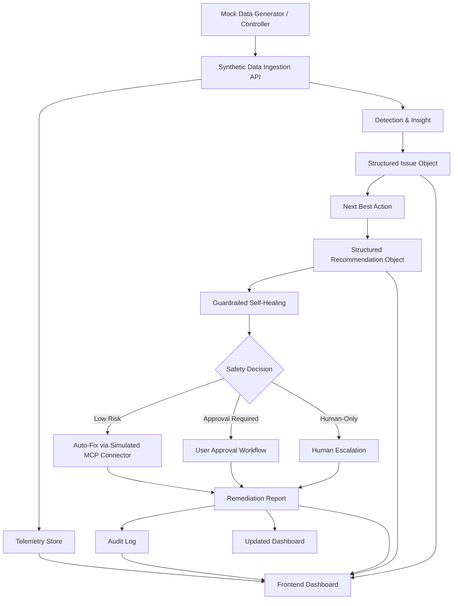

# ARCHITECTURE.md

**Project:** CloudGuard GreenOps — Secure & Energy-Aware Cloud Intelligence Platform
**Context:** ImagineHack 2026, Track 2 (HILTI) — Secure & Energy-Aware Cloud Platforms for Construction Tech
**Status:** Consolidated engineering reference, derived from the full 14-document spec pack (00–13)
**Audience:** Engineers, AI coding agents, and contributors picking up implementation

> This file is the single source of truth for architecture, data contracts, module behavior, safety rules, APIs, UI requirements, demo scenarios, and build plan. It supersedes the need to read all 14 source documents individually — they are preserved as detailed references, but this file should be sufficient on its own for implementation decisions.

---

## Table of Contents

1. [Project Context](#1-project-context)
2. [Problem Statement & Solution](#2-problem-statement--solution)
3. [System Overview](#3-system-overview)
4. [High-Level Architecture](#4-high-level-architecture)
5. [Module 1: Detection & Insight](#5-module-1-detection--insight)
6. [Module 2: Next Best Action](#6-module-2-next-best-action)
7. [Module 3: Guardrailed Self-Healing](#7-module-3-guardrailed-self-healing)
8. [ML, Explainability & Forecasting](#8-ml-explainability--forecasting)
9. [Data Contracts](#9-data-contracts)
10. [Mock Data Specification](#10-mock-data-specification)
11. [API Contracts](#11-api-contracts)
12. [UI/UX Specification](#12-uiux-specification)
13. [Safety, Governance & Audit](#13-safety-governance--audit)
14. [Demo Scenarios & Acceptance Criteria](#14-demo-scenarios--acceptance-criteria)
15. [Implementation Plan](#15-implementation-plan)
16. [Engineering Principles & Definition of Done](#16-engineering-principles--definition-of-done)

---

## 1. Project Context

### 1.1 Hackathon Track

**ImagineHack 2026**
**Track 2 by HILTI:** Secure & Energy-Aware Cloud Platforms for Construction Tech

### 1.2 Track Problem

Cloud platforms support modern construction workflows, but they can be:

- energy-intensive,
- carbon-heavy,
- costly,
- exposed to cybersecurity risks,
- difficult to continuously monitor,
- difficult to optimize safely.

Construction-tech cloud adoption varies across teams, tools, and standards, creating inconsistent visibility and governance. The challenge is to build a solution that continuously monitors cloud environments for security vulnerabilities while identifying carbon-intensive or inefficient workloads — enabling more secure and energy-efficient cloud operations.

### 1.3 Problem Understanding

Construction-tech systems rely on cloud workloads such as field apps, project dashboards, IoT monitoring, BIM processing, reporting systems, document management, databases, cloud compute jobs, cloud storage, and CI/CD pipelines.

Once deployed, these workloads become blind spots. Teams may not clearly know:

- which workloads are insecure,
- which workloads are wasting money,
- which workloads are carbon-heavy,
- which workloads are overprovisioned,
- which workloads are not monitored,
- which workloads may affect construction operations.

The deeper issue is the lack of a unified continuous decision layer connecting:

```text
Security risk + energy usage + carbon impact + cloud cost + workload efficiency + construction workflow importance
```

### 1.4 Clean Problem Statement

Construction-tech cloud platforms support critical workflows, but cloud teams lack a continuous way to connect security monitoring, workload efficiency, energy consumption, carbon impact, and cost optimization. This creates hidden vulnerabilities, unnecessary energy use, higher emissions, wasted cloud spending, and possible disruption to construction operations.

### 1.5 Track Relevance Mapping

| Track Expected Outcome | How the Solution Addresses It |
|---|---|
| Improved cloud security | Detects exposed services, public storage, vulnerabilities, access anomalies |
| Reduced energy consumption | Finds idle, overprovisioned, and inefficient workloads |
| Lower carbon footprint | Forecasts carbon impact and recommends lower-carbon optimization |
| Automated alerts | Issues list and alert-ready recommendation objects |
| Smart recommendations | Rule-based Next Best Action engine |
| Cost optimization | Projected savings forecast and optimization workflow |
| Continuous optimization | Monitoring loop, repeated telemetry ingestion, self-healing cycle |
| Better construction workflow support | Includes workflow criticality in prioritization |
| Operational efficiency | Auto-fix, approval workflow, escalation, audit reports |

### 1.6 Judging Alignment

Judging categories: Content, Technical, Design, Growth & Exploration, Pitching, Track Relevance.

Strengths to lean into: strong problem-solution alignment, clear architecture, visible AI components, safety-aware automation, measurable cost/carbon/security outcomes, polished dashboard UX, live demo scenario control, track-specific construction workflow framing.

### 1.7 MVP Design Philosophy

The MVP does not pretend to have access to real HILTI infrastructure. Instead it honestly demonstrates:

```text
This is how the system behaves when connected to cloud workload telemetry.
```

Therefore: use synthetic cloud telemetry, simulate real cloud signals, trigger realistic scenarios, demonstrate detection, show explainability, show recommendations, show safe remediation, show reports, show projected savings.

---

## 2. Problem Statement & Solution

### 2.1 Solution Statement

A secure and energy-aware cloud intelligence platform that continuously monitors existing construction-tech cloud workloads, detects anomalies and inefficiencies, explains why they matter, recommends the next best action, and safely auto-fixes, asks approval, or escalates issues through a guardrailed remediation workflow.

### 2.2 Core Flow

```text
Detection & Insight → Next Best Action → Guardrailed Self-Healing
```

### 2.3 One-Line Pitch

A guardrailed AI cloud intelligence layer that helps construction-tech teams detect, explain, recommend, and safely fix security, cost, energy, and carbon issues across cloud workloads.

### 2.4 Pitch-Friendly Product Flow

```text
Cloud workloads send signals
→ system detects problems
→ explains what is wrong
→ recommends the next best action
→ safely auto-fixes, asks approval, or escalates
→ reports what improved
```

### 2.5 Core Winning Angle

Not just another cloud dashboard. An **explainable AI decision layer** for secure, energy-aware, and cost-efficient construction-tech cloud operations — combining cloud monitoring, GreenOps, FinOps, DevSecOps, explainable AI, agentic remediation, and human-in-the-loop safety.

### 2.6 What "Cloud Workload" Means

Any application, service, process, resource, or computing task running in the cloud to support a business function. In this project, workloads may represent: field reporting app, project dashboard, IoT monitoring system, BIM processing engine, report generator, document management system, database, VM, container, serverless function, or CI/CD pipeline.

### 2.7 Why Synthetic Data

There is no access to HILTI's real cloud systems, so the MVP uses **synthetic cloud telemetry** via a live mock data generator/controller. This allows triggering demo scenarios (public storage exposure, critical vulnerability, idle dev server, overprovisioned workload, carbon-heavy batch job, cost spike, high error rate, missing monitoring, successful self-healing) on demand. In real deployment, this data would come from cloud APIs, logs, monitoring tools, vulnerability scanners, cost reports, and carbon estimation services.

### 2.8 Engineering Principle (applies to every module)

```text
Detect clearly.
Recommend safely.
Fix responsibly.
Report transparently.
```

---

## 3. System Overview

### 3.1 Working Name

```text
CloudGuard GreenOps
```

(Final naming may change; architecture is name-independent.)

### 3.2 Chosen AI/ML Stack

| Purpose | Chosen Approach |
|---|---|
| Anomaly detection | Isolation Forest |
| Forecasting cost/energy/carbon | XGBoost Regressor |
| Explainability | SHAP / SHAP-style feature contributions |
| User-facing explanation | LLM |
| Recommendation | Rule-based Next Best Action |
| Remediation | Guardrailed agentic AI + MCP/connectors |

**Key design decision:** the LLM explains; it never decides. All anomaly detection, issue classification, recommendation selection, risk scoring, and safety/execution-mode decisions are deterministic (ML model output + rule engines). This is intentional — it is what makes the automation credible and auditable rather than "uncontrolled AI."

### 3.3 Key MVP Features

1. Status heatmap grid
2. Issues list
3. Issue detail + explainability
4. Next Best Action recommendation
5. Optimization Impact Forecast
6. Guardrailed self-healing workflow
7. Auto-fix remediation report
8. Audit log
9. Live mock data generator/controller
10. Demo scenarios for pitch

---

## 4. High-Level Architecture

### 4.1 Core System Flow

```text
Detection & Insight → Next Best Action → Guardrailed Self-Healing
```

Each module receives structured input and produces structured output for the next module — see [Section 9](#9-data-contracts) for exact schemas.

### 4.2 Architecture Layers

1. Live Mock Data Generator / Controller
2. Synthetic Data Ingestion Layer
3. Detection & Insight Module
4. Next Best Action Module
5. Guardrailed Self-Healing Module
6. Forecasting & Explainability Layer
7. Dashboard UI
8. Storage Layer
9. Audit and Reporting Layer

### 4.3 System Architecture Diagram



### 4.4 Module-to-Module Data Flow

```mermaid
flowchart LR
    A[Cloud Workload Telemetry] --> B[Module 1: Detection & Insight]
    B --> C[Structured Issue Object]
    C --> D[Module 2: Next Best Action]
    D --> E[Structured Recommendation Object]
    E --> F[Module 3: Guardrailed Self-Healing]
    F --> G[Execution Result]
    G --> H[Remediation Report + Audit Log]
    H --> I[Dashboard Update]
```



### 4.5 Module Summaries

| Module | Purpose | Input | Processing | Output |
|---|---|---|---|---|
| 1. Detection & Insight | Detect issues and explain why they matter | Cloud Workload Telemetry | Isolation Forest → SHAP/SHAP-style → issue classification rules → LLM explanation | Structured Issue Object |
| 2. Next Best Action | Recommend what to do next | Structured Issue Object | Rule-based NBA engine → risk level → projected savings forecast (XGBoost) | Structured Recommendation Object |
| 3. Guardrailed Self-Healing | Safely execute, request approval, or escalate | Structured Recommendation Object + Safety Context | Safety rules → execution path → connector/action simulation → report + audit | Execution result, remediation report, audit log, updated dashboard |

### 4.6 Supporting Components

**Mock Data Generator** — supplies synthetic telemetry. Must support: healthy baseline stream, triggered issue scenarios, reset to healthy state, repeated live updates.

**ML Layer** — Isolation Forest (anomaly detection), XGBoost Regressor (cost/energy/carbon forecasting), SHAP/SHAP-style explanation generator.

**LLM Layer** — converts technical detection evidence into plain-language explanations, explains recommendations, writes remediation reports. **Not** the final authority for safety decisions (those are rule-based).

**MCP/Connector Layer** — simulated for MVP: simulated cloud connector, simulated ticketing connector, simulated notification connector, simulated audit log connector. Future real connectors: AWS, Azure, GCP, Kubernetes, Terraform, Jira, Slack, Teams, monitoring platforms, security scanners.

### 4.7 Storage Layer

MVP options: JSON files, SQLite, lightweight database, or in-memory storage (demo only).

Recommended minimum stored entities:

- Workload
- TelemetrySnapshot
- Issue
- Recommendation
- Remediation
- AuditLog
- DemoScenario

### 4.8 Frontend Layer — Required Pages

1. Main dashboard
2. Status heatmap grid
3. Issues list
4. Issue detail page
5. Recommendation detail page
6. Approval/self-healing workflow page
7. Remediation report page
8. Audit log page
9. Mock data controller page

---

## 5. Module 1: Detection & Insight

### 5.1 Purpose

Continuously receives cloud workload telemetry, detects anomalies or issues, and explains what is wrong and why it matters. This is the entry point of intelligence in the system.

> **User-facing summary:** Module 1 finds and explains the problem.

### 5.2 Core Flow

```text
Telemetry Input
→ preprocessing
→ Isolation Forest anomaly detection
→ rule-based obvious issue detection
→ SHAP / SHAP-style feature contribution
→ issue classification
→ payload creation
→ LLM explanation
→ Structured Issue Object
```

### 5.3 Inputs

**Cloud Workload Telemetry Object** (see [9.1](#91-module-1-input-cloud-workload-telemetry-object)).

Important fields: workload_id, workload_name, workload_type, cloud_service_type, environment, region, owner_team, workflow_criticality, CPU usage, memory usage, runtime, cost, energy, carbon, public exposure, vulnerability severity, error rate, monitoring status.

### 5.4 Outputs

**Structured Issue Object** sent to Module 2 (see [9.2](#92-module-1-output--module-2-input-structured-issue-object)).

Required fields: issue_id, workload_id, workload_name, issue_type, issue_category, severity, confidence_score, detected_evidence, ml_result, xai_explanation, llm_user_explanation, estimated_impact, status, detected_at.

### 5.5 Detection Methods

#### 5.5.1 Isolation Forest

**Why:** Telemetry is mostly unlabelled — there are no natural ground-truth labels like "normal," "security issue," "cost issue," "carbon issue," "performance issue." Isolation Forest is suitable because it detects unusual patterns without labelled training data (unsupervised anomaly detection).

**Input features:**

- cpu_usage_percent
- memory_usage_percent
- runtime_hours_24h
- request_count_24h
- error_rate_percent
- latency_ms
- cost_24h
- cost_30d_forecast
- energy_kwh_24h
- carbon_kgco2e_24h
- carbon_intensity_gco2_per_kwh
- environment_encoded
- cloud_service_type_encoded
- workflow_criticality_encoded
- public_exposure_encoded
- public_storage_encoded
- monitoring_enabled_encoded
- vulnerability_severity_encoded

**Output:**

```json
{
  "model_name": "Isolation Forest",
  "anomaly_score": -0.71,
  "is_anomaly": true
}
```

#### 5.5.2 Rule-Based Obvious Issue Detection

Isolation Forest flags abnormality but doesn't classify issue type — rules handle classification:

| Rule | Issue Type |
|---|---|
| public_storage = true | public_storage |
| public_exposure = true + vulnerability_severity = critical | critical_exposed_vulnerability |
| cpu < 10 + runtime >= 20h + non-production | idle_or_overprovisioned_workload |
| carbon_kgco2e_24h high + batch workload | carbon_heavy_workload |
| monitoring_enabled = false | no_monitoring |
| error_rate high | high_error_rate |
| cost_30d_forecast high + low utilization | cost_spike_or_waste |

### 5.6 Explainability

#### 5.6.1 SHAP / SHAP-Style Explanation

Answers: *"Which features made this workload look abnormal or risky?"* Framed carefully — never claims perfect causality.

```json
{
  "method": "SHAP-style feature contribution",
  "top_contributing_factors": [
    {"feature": "cpu_usage_percent", "value": 3.2, "impact": "Low CPU contributed to idle workload pattern"},
    {"feature": "runtime_hours_24h", "value": 24, "impact": "Continuous runtime increased waste signal"},
    {"feature": "cost_30d_forecast", "value": 1728, "impact": "High projected cost increased issue severity"}
  ]
}
```

#### 5.6.2 Payload to LLM

Before sending to the LLM, ML/XAI output is converted to a structured prompt payload:

```json
{
  "workload_name": "BIM Processing Engine",
  "environment": "development",
  "issue_type": "overprovisioned_workload",
  "severity": "medium",
  "top_factors": [
    "CPU usage is 3.2%",
    "Runtime is 24 hours",
    "Projected 30-day cost is 1728",
    "Carbon usage is 21.7 kgCO2e/day"
  ],
  "workflow_criticality": "medium"
}
```

### 5.7 LLM Explanation Requirements

The LLM explanation must:

- be short and clear,
- explain what is wrong,
- explain why it matters,
- mention affected workload,
- mention top evidence,
- avoid hallucinated technical details,
- not recommend final action unless Module 2 has generated one.

**Example:**

> The BIM Processing Engine appears overprovisioned because it runs continuously while using very little CPU and memory. Since it is a development workload, this may be causing unnecessary cloud cost, energy usage, and carbon emissions with low immediate risk to field operations.

### 5.8 Severity Logic

| Condition | Severity |
|---|---|
| critical vulnerability in production | critical |
| public storage in production | high/critical |
| high error rate in production | high |
| missing monitoring in production | high |
| idle dev workload | medium |
| overprovisioned test workload | medium |
| carbon-heavy non-urgent batch job | medium |
| minor cost increase | low/medium |

### 5.9 Fallback Behavior

If ML model fails: use rule-based detection only, still generate issue object, mark `ml_result.model_name` as `"fallback_rules_only"`.

If LLM fails: use template explanation, e.g. *"This workload was flagged for {issue_type} because {top_evidence}. It may affect {impact_area}."*

### 5.10 Acceptance Criteria

Module 1 is complete when it can:

- receive telemetry,
- detect at least 5 issue types,
- run Isolation Forest anomaly detection,
- generate SHAP / SHAP-style top factors,
- classify issue type using rules,
- produce structured issue objects,
- generate LLM user explanations or fallback template explanations,
- surface issues in the Issues List.

---

## 6. Module 2: Next Best Action

### 6.1 Purpose

Receives structured issue objects from Module 1 and recommends what should be done next. Answers: *"What should the team do about the issue?"*

### 6.2 Core Flow

```text
Structured Issue Object
→ recommendation rule matching
→ action category selection
→ risk level decision
→ XGBoost forecast result
→ optimization impact forecast
→ LLM recommendation explanation
→ Structured Recommendation Object
```

### 6.3 Inputs / Outputs

**Input:** Structured Issue Object from Module 1. Important fields: issue_type, issue_category, severity, detected_evidence, estimated_impact, environment, workflow_criticality, owner_team, ml_result, xai_explanation.

**Output:** Structured Recommendation Object sent to Module 3 (see [9.3](#93-module-2-output--module-3-input-structured-recommendation-object)). Required fields: recommendation_id, issue_id, workload_id, recommended_action, action_category, recommendation_type, rule_triggered, forecast_model_result, optimization_impact_forecast, risk_level, required_execution_mode, approval_required, llm_recommendation_explanation, rollback_note, created_at.

### 6.4 Recommendation Engine Approach

**Rule-based for MVP.** Rationale: deterministic, explainable, easy to test, easy to adjust, safer than letting an LLM decide actions, credible for cloud/security operations. The LLM may explain the recommendation but is not the decision maker.

### 6.5 Recommendation Rules

#### RULE-SEC-001: Public Exposure + Critical Vulnerability
**If:** public_exposure = true, vulnerability_severity = critical.
**Recommend:** restrict public access, patch or isolate workload, notify security team, require approval/escalation depending on environment.
**Execution mode:** production → human escalation required; staging/development → user approval required.

#### RULE-SEC-002: Public Storage
**If:** public_storage = true.
**Recommend:** restrict public storage access, review bucket/container access policy, notify owner/security team.
**Execution mode:** production or sensitive data → human escalation required; non-production → user approval required.

#### RULE-COST-ENERGY-001: Idle Non-Production Workload
**If:** cpu_usage_percent < 10, runtime_hours_24h >= 20, environment in development/testing/staging, cost_30d_forecast above threshold.
**Recommend:** schedule shutdown outside working hours, resize workload.
**Execution mode:** auto-fix if safety rules allow.

#### RULE-CARBON-001: Carbon-Heavy Batch Job
**If:** workload_type in batch/reporting/BIM processing, carbon_kgco2e_24h above threshold, workflow_criticality is low/medium.
**Recommend:** reschedule job to lower-carbon window, reduce frequency, resize compute.
**Execution mode:** auto-fix if non-production and reversible, otherwise user approval required.

#### RULE-PERF-001: High Error Rate
**If:** error_rate_percent above threshold.
**Recommend:** investigate logs, notify DevOps/SRE, create incident if production.
**Execution mode:** production → human escalation required; non-production → user approval or ticket creation.

#### RULE-MON-001: Missing Monitoring
**If:** monitoring_enabled = false.
**Recommend:** enable monitoring, create owner ticket, add workload to dashboard.
**Execution mode:** auto-create ticket; auto-enable basic monitoring if safe.

#### RULE-COST-001: Cost Spike
**If:** cost_24h or cost_30d_forecast above threshold, low or moderate utilization.
**Recommend:** review usage, notify owner, resize or schedule shutdown.
**Execution mode:** depends on environment and safety.

### 6.6 Conflict Resolution and Recommendation Merging

A single workload's telemetry can satisfy the conditions of more than one rule at once. For example, an idle non-production workload (RULE-COST-ENERGY-001: low CPU + high runtime + non-production) very often *also* has elevated carbon impact, since the same wasted compute that drives up cost also drives up energy and carbon. Without explicit handling, the NBA engine could fire RULE-COST-ENERGY-001 and RULE-CARBON-001 independently and surface two competing recommendations for the same underlying problem — e.g. "schedule shutdown" and "reschedule batch job" both appearing for one workload.

**Decision:** the NBA engine must not generate duplicate or competing recommendations for a single underlying problem. Multiple rules are allowed to match simultaneously, but they are **merged into one primary recommendation** rather than surfaced as separate, parallel actions.

**Design principle:**

> Allow multiple conditions to match, merge related signals, then select one primary Next Best Action based on severity, expected impact, and safety.

**How cost, energy, and carbon relate to each other in this model:** they are treated as **impact evidence for the same action**, not as three separate problems requiring three separate fixes. If a workload is idle and wasteful, the cost impact, energy impact, and carbon impact are three ways of measuring the *consequence* of the same root cause (unnecessary running compute) — not three distinct issues. The merged recommendation cites all three as supporting evidence (e.g. in `optimization_impact_forecast`, all three are still calculated and shown — see [Section 6.8](#68-optimization-impact-forecast)), but only **one** `recommended_action` / `recommendation_type` is produced.

**Worked example:**

A workload satisfies:
- RULE-COST-ENERGY-001 (low CPU, high runtime, non-production, cost above threshold)
- RULE-CARBON-001 (carbon above threshold, low/medium criticality)

Instead of generating two recommendation objects, the engine merges them into one:

```json
{
  "recommendation_type": "shutdown_schedule_and_resize",
  "recommended_action": "Limit usage during inactive hours: schedule shutdown outside working hours and resize the workload.",
  "rule_triggered": {
    "primary_rule_id": "RULE-COST-ENERGY-001",
    "contributing_rule_ids": ["RULE-CARBON-001"],
    "merge_reason": "Idle/overprovisioned pattern is the root cause; elevated carbon is a downstream impact of the same root cause, not a separate issue."
  }
}
```

Note `rule_triggered` now distinguishes a **primary rule** (the one that determines the action) from **contributing rules** (signals folded in as supporting evidence) — this is a small but necessary extension to the `rule_triggered` schema defined in [Section 9.3](#93-module-2-output--module-3-input-structured-recommendation-object).

**Merge logic (applied in order):**

1. **Group matched rules by root cause**, not by metric category. Rules whose conditions overlap heavily in underlying cause (e.g. all driven by "low utilization, non-production, long runtime") are candidates for merging, even if they were written under different metric headings (cost, energy, carbon).
2. **Select the primary rule** — the one whose action most directly addresses the root cause (typically the rule with the most specific/operational trigger, e.g. "idle workload" over "carbon heavy," since fixing idleness fixes the carbon symptom too). Ties are broken by severity, then by safety (prefer the rule whose execution mode is least permissive, to stay conservative).
3. **Fold remaining matched rules in as evidence**, not as additional actions. Their thresholds/values still appear in `detected_evidence` and `xai_explanation` (Module 1) and in the forecast/impact numbers (Module 2) — they inform *why* the action matters and *how much* it will help, but they don't spawn their own `recommended_action`.
4. **Exception — genuinely independent issues do not merge.** If a workload simultaneously triggers, say, RULE-SEC-001 (critical vulnerability) and RULE-COST-ENERGY-001 (idle workload), these are not the same root cause and must **not** be merged into one recommendation — a security exposure and a cost-waste pattern require genuinely different actions and likely different execution modes. In this case, the engine should generate two separate recommendation objects against the same `issue_id`'s underlying issue cluster, each independently risk-scored. The merge rule in this section applies only within a cluster of rules that share a root cause; it does not force unrelated problems into a single action.

**Note on feature correlation (related but distinct question):** the above is about merging *recommendations*, not about removing *features* from the underlying models. Correlation between input features (e.g. low CPU usage correlating with high carbon) is expected in this domain and is not itself a problem to "fix" by dropping features from Isolation Forest or XGBoost. Correlated features are only removed if they are pure duplicates (literally redundant, e.g. the same value in two different units) or if they make the SHAP-style explanation confusing to read. Otherwise, correlated features are kept, because — even when correlated — they explain different business impacts (a CFO cares about cost, a sustainability lead cares about carbon, even if both numbers move together for the same workload). This distinction should be reflected in both the Module 1 feature set ([Section 8.4](#84-isolation-forest-features)) and the Module 2 merge logic above: keep the features, merge the resulting actions.

### 6.7 Risk Level Logic

| Condition | Risk Level |
|---|---|
| non-production + reversible + low criticality | low |
| staging + reversible + medium criticality | medium |
| production + config change | high |
| production + security issue + sensitive data | critical |
| unknown dependency risk | critical |

### 6.8 Execution Mode Logic

| Risk / Context | Execution Mode |
|---|---|
| low-risk, reversible, non-production | auto_fix |
| medium/high-risk but AI can execute with permission | user_approval_required |
| critical, sensitive, unknown risk, production incident | human_escalation_required |

### 6.9 Optimization Impact Forecast

Module 2 must attach projected savings to recommendations. Uses XGBoost Regressor to predict cost_30d, energy_kwh_30d, carbon_kgco2e_30d, then calculates optimized forecast using the recommendation type:

```text
forecast_without_action = XGBoost prediction
forecast_after_action = forecast_without_action × optimization_factor
projected_savings = forecast_without_action - forecast_after_action
```

**Optimization factors:**

| Recommendation Type | Cost Factor | Energy Factor | Carbon Factor |
|---|---:|---:|---:|
| shutdown_schedule | 0.20–0.45 | 0.20–0.45 | 0.20–0.45 |
| resize_workload | 0.40–0.75 | 0.40–0.75 | 0.40–0.75 |
| reschedule_batch_job | 0.75–0.90 | 0.90–1.00 | 0.60–0.85 |
| enable_monitoring | 1.00 | 1.00 | 1.00 |
| security_patch | 1.00 | 1.00 | 1.00 |

For security-only issues, projected savings may be zero or not applicable.

### 6.10 LLM Recommendation Explanation

Must explain: what action is recommended, why, expected impact, whether approval is required, rollback note.

**Example:**

> Because this is a development workload with very low utilization and continuous runtime, the recommended action is to schedule shutdown outside working hours and reduce allocated resources. This is expected to lower monthly cost, energy consumption, and carbon emissions with low operational risk.

### 6.11 Threshold-Setting Methodology

The rules in [Section 6.5](#65-recommendation-rules) reference conditions like "cost_30d_forecast above threshold" or "carbon_kgco2e_24h above threshold" without specifying the number. This subsection defines how those numbers are actually set.

**Decision:** Thresholds are not hardcoded constants chosen by engineering, and they are not purely model-derived. They are set through a **two-input process**:

1. **Domain expert judgment** defines what *kind* of deviation matters and roughly where the line should sit — e.g. a FinOps/GreenOps/security stakeholder decides "a non-production workload idling above 20 hours/day is a waste signal worth flagging," or "carbon intensity above X kgCO2e/24h for a batch job is worth optimizing." This captures business and operational context that data alone can't supply — risk tolerance, what counts as "critical" for this organization, which workloads are allowed more slack.
2. **Historical telemetry** anchors that judgment to the workload's actual behavior, rather than applying one global number across every workload type. The threshold becomes relative to a workload's own historical baseline (e.g. mean + N standard deviations of `cost_24h` over its trailing 30 days) instead of a flat figure that may be irrelevant for a workload 10x larger or smaller than the "typical" case.

**Why both inputs are needed:**

- Historical data alone (pure statistical outlier detection) is already partially handled by Isolation Forest ([Section 8](#8-ml-explainability--forecasting)) — but Isolation Forest only says "this is unusual," not "this unusual pattern is a *cost* issue specifically, and it's bad enough to warrant a *user-approval* execution mode rather than auto-fix." That judgment call about severity and response is inherently a domain/business decision, not something inferable from telemetry shape alone.
- Domain judgment alone (a flat threshold an expert picks from memory) ignores the fact that workloads vary enormously in scale — RM 2,000/month might be alarming for a small dev container and trivial for a production database. A single flat number either over-flags small workloads or under-flags large ones.

**Practical implementation approach for the MVP:**

```text
threshold(workload, metric) = baseline(workload, metric) × multiplier(metric)
```

Where:
- `baseline(workload, metric)` is derived from the workload's historical/synthetic telemetry (e.g. trailing 30-day mean for `cost_30d_forecast`, `carbon_kgco2e_24h`, etc. — see [Section 10.9](#109-data-needed-for-xgboost-forecast) for the historical data already being generated for XGBoost).
- `multiplier(metric)` is the domain-expert-set sensitivity factor per metric (e.g. "flag if 1.5x above baseline" for cost, "flag if 2x above baseline" for carbon) — stored in `/rules/detection_rules.json` and `/rules/recommendation_rules.json` as configurable, named values rather than buried in code.

This keeps the rule engine's *logic* exactly as specified in Section 6.5 (same conditions, same structure) while making the *threshold values* a configuration concern — adjustable by a domain expert without an engineer touching code, and grounded in each workload's real historical pattern rather than a one-size-fits-all constant.

**Action items before Phase 2/3 implementation:**

- [ ] Domain expert sets the initial `multiplier` value per metric (cost, carbon, energy, error rate) and per rule.
- [ ] Engineering computes `baseline(workload, metric)` from the historical synthetic dataset (Section 10.9) for each of the 8 mock workloads.
- [ ] Both values are stored together in `/rules/*.json` so they can be tuned independently — historical baselines refresh as new telemetry arrives; multipliers stay stable until a domain expert revisits them.
- [ ] For the demo specifically: verify the resulting computed thresholds still correctly fire on the scenario payloads in [Section 10.5](#105-required-demo-scenarios) — since baselines are now data-derived rather than hand-picked, re-validate each trigger still produces the intended issue/severity before the live demo.

### 6.12 Acceptance Criteria

Module 2 is complete when it can:

- receive structured issue objects,
- map issue types to recommendations,
- generate structured recommendation objects,
- attach risk level,
- choose execution mode,
- attach projected cost/energy/carbon forecast,
- provide LLM or template recommendation explanation,
- surface the recommendation on the issue detail page.

---

## 7. Module 3: Guardrailed Self-Healing

### 7.1 Purpose

Receives structured recommendations from Module 2 and decides how to handle the issue safely. Answers: *"Should the system auto-fix, ask for user approval, or escalate to a human team?"*

### 7.2 Core Flow

```text
Structured Recommendation Object
→ safety context evaluation
→ safety rule engine
→ execution path decision
→ simulated agentic action via MCP/connectors
→ remediation report
→ audit log
→ dashboard update
```

### 7.3 Execution Paths

#### 7.3.1 Auto-Fix
Low-risk, reversible, non-production actions. Examples: stop idle dev server, schedule shutdown for non-production resource, resize low-criticality dev/test workload, create ticket, notify owner, apply tag, enable basic monitoring if safe.

#### 7.3.2 User-Approved Fix
Actions AI can execute, but only after approval. Examples: resize staging workload, restrict public access in controlled environment, schedule patching, adjust batch job schedule, change monitoring configuration.

#### 7.3.3 Human Escalation
Issues AI should not fix directly. Examples: critical production vulnerability, sensitive data exposure, major outage, unknown dependency risk, production database changes, critical security/network policy changes.

### 7.4 Inputs

**Structured Recommendation Object + Safety Context.** Important fields: recommendation_id, issue_id, workload_id, recommended_action, risk_level, required_execution_mode, approval_required, environment, workflow_criticality, is_production, has_sensitive_data, is_reversible_action, requires_downtime, affects_network_security, affects_database, available_connectors.

### 7.5 Outputs

**Remediation Result + Remediation Report + Audit Log.** Must include: remediation_id, recommendation_id, issue_id, workload_id, execution_path, execution_status, action_taken, reason_for_action, safety_decision, impact_result, user_facing_report, audit_log.

### 7.6 Agentic AI Role

This module is described as a **guardrailed agentic AI remediation layer**. The agent may: prepare an action plan, call simulated MCP tools/connectors, create tickets, send notifications, simulate cloud changes, generate remediation reports.

**The agent must not override safety rules. Safety rules are the final authority.**

### 7.7 Simulated MCP / Connector Tools

For MVP, all connectors are simulated — they update system state and generate logs, but never touch real cloud systems.

#### 7.7.1 Simulated Cloud Connector
- `stop_resource(workload_id)`
- `schedule_shutdown(workload_id, schedule)`
- `resize_resource(workload_id, cpu, memory)`
- `restrict_public_access(workload_id)`
- `enable_monitoring(workload_id)`
- `reschedule_batch_job(workload_id, schedule)`

#### 7.7.2 Simulated Ticketing Connector
- `create_ticket(issue_id, title, description, owner_team, severity)`
- `update_ticket(ticket_id, status)`
- `assign_ticket(ticket_id, owner_team)`

#### 7.7.3 Simulated Notification Connector
- `notify_owner(owner_team, message)`
- `notify_security_team(message)`
- `notify_devops_team(message)`

#### 7.7.4 Audit Log Connector
- `write_audit_log(event)`
- `get_audit_logs(issue_id)`
- `get_audit_log(audit_id)`

### 7.8 Safety Rules

See [Section 13](#13-safety-governance--audit) for the full, authoritative safety rule set (this is the same logic referenced here and in Module 2's execution mode logic — Section 13 is the canonical version).

### 7.9 Remediation Report Requirements

Every action must generate a report answering:

- what issue was detected,
- what workload was affected,
- what action was taken,
- why this action was chosen,
- why it was safe or why approval/escalation was required,
- when it happened,
- what connector/action was used,
- what improved,
- what rollback/follow-up exists.

### 7.10 UI Behavior by Execution Path

**Auto-Fix:** action completed, report generated, issue status remediated, heatmap improved, audit log updated.

**Approval:** approval required, recommended action, safety explanation, expected impact, approve/reject buttons.

**Escalation:** human intervention required, reason AI cannot fix, recommended next human action, escalation/ticket status.

### 7.11 Acceptance Criteria

Module 3 is complete when it can:

- receive recommendation objects,
- evaluate safety context,
- choose auto-fix, approval, or escalation,
- simulate at least 3 action types,
- generate remediation reports,
- write audit logs,
- update issue status,
- update dashboard status,
- never auto-fix prohibited actions.

---

## 8. ML, Explainability & Forecasting

### 8.1 Chosen Stack

```text
Anomaly Detection: Isolation Forest
Forecasting: XGBoost Regressor
Explainability: SHAP / SHAP-style feature contributions
User Explanation: LLM
Recommendations: Rule-based NBA
Remediation: Guardrailed agentic AI + MCP/connectors
```

### 8.2 Why Isolation Forest

Telemetry is mostly unlabelled — there are no naturally-occurring ground truth labels (normal / security issue / cost issue / carbon issue / performance issue). Supervised classifiers (e.g. XGBoost classifier) aren't ideal for the main detection task unless artificial labels are created. Isolation Forest learns normal workload patterns and flags unusual workloads without labels.

**What it detects:** unusually low CPU but high runtime, unusually high cost, unusually high carbon, high error rate vs. baseline, abnormal memory/runtime pattern, unusual workload behavior.

**What it does not do:** Isolation Forest does not know *whether* an anomaly is a security/carbon/cost/monitoring issue — issue classification is handled by rules after anomaly detection.

### 8.3 Detection Pipeline

```text
Telemetry
→ feature preprocessing
→ Isolation Forest anomaly score
→ anomaly flag
→ SHAP / SHAP-style top feature contribution
→ rule-based issue classification
→ structured issue object
→ LLM explanation
```

### 8.4 Isolation Forest Features

| Feature | Type |
|---|---|
| cpu_usage_percent | numeric |
| memory_usage_percent | numeric |
| runtime_hours_24h | numeric |
| storage_gb | numeric |
| request_count_24h | numeric |
| error_rate_percent | numeric |
| latency_ms | numeric |
| cost_24h | numeric |
| cost_30d_forecast | numeric |
| energy_kwh_24h | numeric |
| carbon_kgco2e_24h | numeric |
| carbon_intensity_gco2_per_kwh | numeric |
| environment_encoded | categorical encoded |
| cloud_service_type_encoded | categorical encoded |
| workflow_criticality_encoded | categorical encoded |
| public_exposure_encoded | boolean encoded |
| public_storage_encoded | boolean encoded |
| monitoring_enabled_encoded | boolean encoded |
| vulnerability_severity_encoded | ordinal encoded |

### 8.5 SHAP / SHAP-Style Explanation

**Purpose:** explain why the model flagged a workload as anomalous. Framed as *"Top telemetry features contributing to the anomaly score"* — never claims causal proof.

```json
{
  "method": "SHAP-style feature contribution",
  "top_contributing_factors": [
    {"feature": "cpu_usage_percent", "value": 3.2, "impact": "Low CPU usage contributed to idle anomaly"},
    {"feature": "runtime_hours_24h", "value": 24, "impact": "Continuous runtime increased waste signal"},
    {"feature": "cost_30d_forecast", "value": 1728.0, "impact": "High future cost increased anomaly impact"}
  ]
}
```

### 8.6 Why XGBoost Regressor for Forecasting

Chosen for forecasting future cost, energy, and carbon — gives the MVP a stronger AI/ML layer than formula-only forecasting. Because data is synthetic, the model must be framed honestly:

> The MVP trains and demonstrates XGBoost forecasting on synthetic historical telemetry. In real deployment, this model would be trained on historical cloud usage and cost/carbon data.

### 8.7 Forecast Targets

1. `predicted_cost_30d`
2. `predicted_energy_kwh_30d`
3. `predicted_carbon_kgco2e_30d`

**Simplest implementation:** train 3 separate XGBoost Regressor models (one per target). Alternative: one multi-output wrapper.

### 8.8 Forecast Features

- workload_type_encoded
- cloud_service_type_encoded
- environment_encoded
- region_encoded
- workflow_criticality_encoded
- cpu_usage_percent
- memory_usage_percent
- runtime_hours_24h
- storage_gb
- request_count_24h
- error_rate_percent
- latency_ms
- cost_24h
- energy_kwh_24h
- carbon_kgco2e_24h
- carbon_intensity_gco2_per_kwh
- public_exposure_encoded
- monitoring_enabled_encoded

### 8.9 Synthetic Forecast Training Data

```text
target_cost_30d = cost_24h × 30 × noise_factor
target_energy_kwh_30d = energy_kwh_24h × 30 × noise_factor
target_carbon_kgco2e_30d = carbon_kgco2e_24h × 30 × noise_factor

noise_factor between 0.85 and 1.20
```

For issue scenarios, increase targets to simulate waste.

### 8.10 Optimization Impact Forecast

XGBoost predicts the baseline future if no action is taken. Module 2 then calculates the optimized future by applying a recommendation-specific optimization factor:

```text
predicted_cost_without_action = XGBoost predicted_cost_30d
predicted_cost_after_action = predicted_cost_without_action × optimization_factor
projected_saving = predicted_cost_without_action - predicted_cost_after_action
```

Same logic applies to energy and carbon.

### 8.11 Optimization Factors (canonical table)

| Recommendation Type | Cost Factor | Energy Factor | Carbon Factor |
|---|---:|---:|---:|
| shutdown_schedule | 0.20–0.45 | 0.20–0.45 | 0.20–0.45 |
| resize_workload | 0.40–0.75 | 0.40–0.75 | 0.40–0.75 |
| shutdown_and_resize | 0.25–0.50 | 0.25–0.50 | 0.25–0.50 |
| reschedule_batch_job | 0.75–0.90 | 0.90–1.00 | 0.60–0.85 |
| enable_monitoring | 1.00 | 1.00 | 1.00 |
| restrict_public_access | 1.00 | 1.00 | 1.00 |
| patch_vulnerability | 1.00 | 1.00 | 1.00 |

### 8.12 Forecast Output Example

```json
{
  "forecast_model_result": {
    "model_name": "XGBoost Regressor",
    "predicted_cost_30d": 1728.0,
    "predicted_energy_kwh_30d": 1155.0,
    "predicted_carbon_kgco2e_30d": 651.0
  },
  "optimization_impact_forecast": {
    "forecast_without_action": {
      "cost_30d": 1728.0,
      "energy_30d_kwh": 1155.0,
      "carbon_30d_kgco2e": 651.0
    },
    "forecast_after_action": {
      "cost_30d": 778.0,
      "energy_30d_kwh": 585.0,
      "carbon_30d_kgco2e": 330.5
    },
    "projected_savings": {
      "cost_30d": 950.0,
      "energy_30d_kwh": 570.0,
      "carbon_30d_kgco2e": 320.5
    }
  }
}
```

### 8.13 Fallback Strategy

If XGBoost is not ready: use formula-based forecast, keep the same output schema, set `model_name` to `"deterministic_forecast_fallback"`.

If SHAP is not ready: use top rule-triggered features as explanation, set method to `"rule-based feature contribution fallback"`.

### 8.14 Model Training Cadence: Frozen During Demo

A natural question for any anomaly detection model is whether it keeps learning as new telemetry arrives, or stays fixed. For the MVP/demo, the decision is **no live retraining** — the Isolation Forest model is trained once, before the demo, and frozen for the duration of the demo.

**Flow:**

```text
Before demo: train Isolation Forest on normal synthetic baseline data.
During demo: send live mock telemetry into the frozen model.
The model flags abnormal workloads, but it does not retrain live.
```

Live mock telemetry is still used during the demo — but strictly for **inference/detection**, not for updating the model's learned notion of "normal." The model that scores a workload as anomalous during the live demo is the exact same model artifact trained beforehand on the synthetic historical/baseline dataset described in [Section 10.9](#109-data-needed-for-xgboost-forecast) (the same historical generation effort that feeds XGBoost also supplies Isolation Forest's training data).

**Why this matters:** retraining live, in front of judges, introduces a class of failure that's hard to debug under time pressure — if a demo scenario telemetry patch gets folded into "what's normal" mid-demo, the model's anomaly threshold can shift unpredictably between scenario triggers, making detection behavior inconsistent between dry-run and live demo. Freezing the model removes this variable entirely: the same input always produces the same anomaly score, which is what makes the rehearsed demo flow (Section 14.2) reliably reproducible.

**Real deployment note:** outside the demo context, the model would be retrained periodically against real historical cloud telemetry — e.g. weekly or monthly, depending on observed workload drift — rather than frozen indefinitely. This MVP constraint is a demo-stability decision, not a claim about how the model should behave in production.

### 8.15 Acceptance Criteria

ML/Forecasting is complete when:

- Isolation Forest can generate anomaly score,
- anomaly result is stored in issue object,
- SHAP or SHAP-style top factors are generated,
- XGBoost predicts 30-day cost/energy/carbon,
- projected savings are calculated,
- forecast appears in recommendation detail page,
- fallback works if model fails.

---

## 9. Data Contracts

This section defines the exact inputs and outputs for all modules. Core flow:

```text
Telemetry → Issue → Recommendation → Remediation Report
```

### 9.1 Module 1 Input: Cloud Workload Telemetry Object

```json
{
  "workload_id": "wl-bim-processor-001",
  "workload_name": "BIM Processing Engine",
  "workload_type": "BIM Processing Job",
  "cloud_service_type": "container",
  "environment": "development",
  "region": "ap-southeast-1",
  "owner_team": "Construction Analytics Team",
  "workflow_criticality": "medium",

  "cpu_usage_percent": 3.2,
  "memory_usage_percent": 18.5,
  "runtime_hours_24h": 24,
  "storage_gb": 250,
  "request_count_24h": 120,
  "error_rate_percent": 0.5,
  "latency_ms": 180,

  "public_exposure": false,
  "public_storage": false,
  "vulnerability_severity": "none",
  "critical_vulnerability_count": 0,
  "access_anomaly_detected": false,
  "monitoring_enabled": true,

  "cost_per_hour": 2.40,
  "cost_24h": 57.60,
  "cost_30d_forecast": 1728.00,

  "energy_kwh_24h": 38.5,
  "carbon_kgco2e_24h": 21.7,
  "carbon_intensity_gco2_per_kwh": 563,

  "timestamp": "2026-06-20T10:30:00Z"
}
```

**Required fields:**

| Field | Type | Description |
|---|---|---|
| workload_id | string | Unique workload identifier |
| workload_name | string | Human-readable workload name |
| workload_type | string | Business workload type |
| cloud_service_type | string | VM, container, database, storage, serverless, pipeline |
| environment | string | production, staging, testing, development |
| region | string | Cloud region |
| owner_team | string | Responsible team |
| workflow_criticality | string | low, medium, high, critical |
| cpu_usage_percent | number | CPU usage percentage |
| memory_usage_percent | number | Memory usage percentage |
| runtime_hours_24h | number | Runtime in last 24 hours |
| error_rate_percent | number | Error rate |
| public_exposure | boolean | Whether workload is publicly exposed |
| public_storage | boolean | Whether storage is public |
| vulnerability_severity | string | none, low, medium, high, critical |
| critical_vulnerability_count | number | Count of critical vulnerabilities |
| monitoring_enabled | boolean | Whether monitoring exists |
| cost_24h | number | Cost in last 24 hours |
| cost_30d_forecast | number | 30-day cost forecast |
| energy_kwh_24h | number | Estimated 24h energy usage |
| carbon_kgco2e_24h | number | Estimated 24h carbon emissions |
| timestamp | string | Timestamp |

### 9.2 Module 1 Output / Module 2 Input: Structured Issue Object

```json
{
  "issue_id": "iss-0001",
  "workload_id": "wl-bim-processor-001",
  "workload_name": "BIM Processing Engine",
  "workload_type": "BIM Processing Job",
  "environment": "development",
  "region": "ap-southeast-1",
  "owner_team": "Construction Analytics Team",
  "workflow_criticality": "medium",

  "issue_type": "overprovisioned_workload",
  "issue_category": "cost_energy_carbon",
  "severity": "medium",
  "confidence_score": 0.91,

  "detected_evidence": {
    "cpu_usage_percent": 3.2,
    "memory_usage_percent": 18.5,
    "runtime_hours_24h": 24,
    "cost_24h": 57.6,
    "carbon_kgco2e_24h": 21.7
  },

  "ml_result": {
    "model_name": "Isolation Forest",
    "anomaly_score": -0.71,
    "is_anomaly": true
  },

  "xai_explanation": {
    "method": "SHAP-style feature contribution",
    "top_contributing_factors": [
      {"feature": "cpu_usage_percent", "value": 3.2, "impact": "Strong contribution to abnormal low-utilization pattern"},
      {"feature": "runtime_hours_24h", "value": 24, "impact": "Continuous runtime despite low utilization"},
      {"feature": "cost_30d_forecast", "value": 1728.0, "impact": "High projected cost increases issue impact"},
      {"feature": "environment", "value": "development", "impact": "Non-production workload is likely safe to optimize"}
    ]
  },

  "llm_user_explanation": "The BIM Processing Engine appears overprovisioned because it runs continuously while using very low CPU and memory. Since it is a development workload, it may be safe to resize or schedule shutdown to reduce cost, energy usage, and carbon impact.",

  "estimated_impact": {
    "cost_risk": "high",
    "energy_risk": "medium",
    "carbon_risk": "medium",
    "security_risk": "low",
    "workflow_disruption_risk": "low"
  },

  "status": "new",
  "detected_at": "2026-06-20T10:31:00Z"
}
```

**Required fields:**

| Field | Type | Description |
|---|---|---|
| issue_id | string | Unique issue ID |
| workload_id | string | Affected workload |
| workload_name | string | Affected workload name |
| environment | string | Environment |
| owner_team | string | Responsible team |
| workflow_criticality | string | Workflow importance |
| issue_type | string | Specific issue type |
| issue_category | string | security, cost, energy, carbon, performance, monitoring |
| severity | string | low, medium, high, critical |
| confidence_score | number | Detection confidence |
| detected_evidence | object | Evidence that triggered issue |
| ml_result | object | Isolation Forest result |
| xai_explanation | object | SHAP / SHAP-style explanation |
| llm_user_explanation | string | User-facing explanation |
| estimated_impact | object | Impact summary |
| status | string | new, recommended, approved, remediated, escalated |
| detected_at | string | Timestamp |

### 9.3 Module 2 Output / Module 3 Input: Structured Recommendation Object

```json
{
  "recommendation_id": "rec-0001",
  "issue_id": "iss-0001",
  "workload_id": "wl-bim-processor-001",
  "workload_name": "BIM Processing Engine",

  "recommended_action": "Schedule automatic shutdown outside working hours and resize the container resource limit.",
  "action_category": "cost_energy_carbon_optimization",
  "recommendation_type": "shutdown_schedule_and_resize",

  "rule_triggered": {
    "rule_id": "RULE-COST-ENERGY-001",
    "rule_name": "Low utilization non-production workload running continuously",
    "conditions_matched": [
      "cpu_usage_percent < 10",
      "runtime_hours_24h >= 20",
      "environment in development/testing/staging",
      "cost_30d_forecast > configured_threshold"
    ]
  },

  "forecast_model_result": {
    "model_name": "XGBoost Regressor",
    "predicted_cost_30d": 1728.0,
    "predicted_energy_kwh_30d": 1155.0,
    "predicted_carbon_kgco2e_30d": 651.0
  },

  "optimization_impact_forecast": {
    "forecast_without_action": {
      "cost_30d": 1728.0,
      "carbon_30d_kgco2e": 651.0,
      "energy_30d_kwh": 1155.0
    },
    "forecast_after_action": {
      "cost_30d": 778.0,
      "carbon_30d_kgco2e": 330.5,
      "energy_30d_kwh": 585.0
    },
    "projected_savings": {
      "cost_30d": 950.0,
      "carbon_30d_kgco2e": 320.5,
      "energy_30d_kwh": 570.0
    }
  },

  "risk_level": "low",
  "required_execution_mode": "auto_fix",
  "approval_required": false,

  "llm_recommendation_explanation": "Because this is a development workload with very low utilization and continuous runtime, the system recommends scheduling shutdown outside working hours and reducing allocated resources. This should reduce cost, energy usage, and carbon emissions with low risk to construction operations.",

  "rollback_note": "The workload can be restarted manually or automatically if needed. Resource limits can be restored to the previous configuration.",
  "created_at": "2026-06-20T10:32:00Z"
}
```

**Required fields:**

| Field | Type | Description |
|---|---|---|
| recommendation_id | string | Unique recommendation ID |
| issue_id | string | Linked issue ID |
| workload_id | string | Affected workload |
| recommended_action | string | Recommended next step |
| action_category | string | Action category |
| recommendation_type | string | Specific recommendation class |
| rule_triggered | object | Rule that fired |
| forecast_model_result | object | XGBoost forecast result |
| optimization_impact_forecast | object | Before/after forecast |
| risk_level | string | low, medium, high, critical |
| required_execution_mode | string | auto_fix, user_approval_required, human_escalation_required |
| approval_required | boolean | Whether approval is needed |
| llm_recommendation_explanation | string | Human-readable explanation |
| rollback_note | string | Rollback info |
| created_at | string | Timestamp |

### 9.4 Module 3 Input: Recommendation + Safety Context

```json
{
  "recommendation": {
    "recommendation_id": "rec-0001",
    "issue_id": "iss-0001",
    "workload_id": "wl-bim-processor-001",
    "recommended_action": "Schedule automatic shutdown outside working hours and resize the container resource limit.",
    "risk_level": "low",
    "required_execution_mode": "auto_fix",
    "approval_required": false
  },

  "safety_context": {
    "environment": "development",
    "workflow_criticality": "medium",
    "is_production": false,
    "has_sensitive_data": false,
    "is_reversible_action": true,
    "requires_downtime": false,
    "affects_network_security": false,
    "affects_database": false,
    "owner_team": "Construction Analytics Team"
  },

  "available_connectors": {
    "cloud_connector_available": true,
    "ticketing_connector_available": true,
    "notification_connector_available": true,
    "audit_log_available": true
  }
}
```

### 9.5 Module 3 Output: Remediation Result

```json
{
  "remediation_id": "rem-0001",
  "recommendation_id": "rec-0001",
  "issue_id": "iss-0001",
  "workload_id": "wl-bim-processor-001",
  "workload_name": "BIM Processing Engine",

  "execution_path": "auto_fix",
  "execution_status": "completed",

  "action_taken": {
    "action_name": "Scheduled shutdown and resized resource limit",
    "action_details": [
      "Applied shutdown schedule from 7:00 PM to 7:00 AM",
      "Reduced container CPU limit from 4 vCPU to 1 vCPU",
      "Reduced memory limit from 8 GB to 2 GB"
    ],
    "executed_by": "Guardrailed Self-Healing Agent",
    "connector_used": "simulated_cloud_connector"
  },

  "reason_for_action": "The workload was a non-production development workload with very low CPU usage, continuous runtime, and high projected cost/carbon impact.",

  "safety_decision": {
    "why_safe": "The action was reversible, non-production, did not affect sensitive data, and did not modify network or database configuration.",
    "approval_required": false,
    "rollback_available": true
  },

  "impact_result": {
    "before": {
      "forecast_cost_30d": 1728.0,
      "forecast_carbon_30d_kgco2e": 651.0,
      "forecast_energy_30d_kwh": 1155.0
    },
    "after": {
      "forecast_cost_30d": 778.0,
      "forecast_carbon_30d_kgco2e": 330.5,
      "forecast_energy_30d_kwh": 585.0
    },
    "simulated_savings": {
      "cost_30d": 950.0,
      "carbon_30d_kgco2e": 320.5,
      "energy_30d_kwh": 570.0
    }
  },

  "user_facing_report": "The BIM Processing Engine was automatically optimized because it was a low-risk development workload running continuously with very low utilization. The system scheduled shutdown outside working hours and reduced allocated resources. This is projected to save 950.00 in monthly cloud cost and reduce 320.5 kgCO2e over 30 days. The action is reversible.",

  "audit_log": {
    "event_type": "auto_fix_completed",
    "actor": "Guardrailed Self-Healing Agent",
    "timestamp": "2026-06-20T10:35:00Z",
    "previous_status": "issue_detected",
    "new_status": "remediated",
    "rollback_note": "Restore previous resource limits and remove shutdown schedule if workload demand increases."
  }
}
```

### 9.6 Status Enumerations

**Issue Status:**
```text
new
recommended
pending_approval
approved
auto_fixed
remediated
escalated
rejected
dismissed
```

**Severity:**
```text
low
medium
high
critical
```

**Environment:**
```text
production
staging
testing
development
```

**Execution Mode:**
```text
auto_fix
user_approval_required
human_escalation_required
```

**Execution Status:**
```text
not_started
pending_approval
in_progress
completed
failed
escalated
rejected
```

### 9.7 End-to-End Contract Summary

```text
Synthetic cloud workload telemetry
→ Module 1: Detection & Insight
→ Structured issue object
→ Module 2: Next Best Action
→ Structured recommendation object
→ Module 3: Guardrailed Self-Healing
→ Auto-fix / user approval / human escalation
→ Remediation report + audit log + updated dashboard
```

---

## 10. Mock Data Specification

### 10.1 Purpose

Because there is no access to real HILTI cloud systems, the MVP uses synthetic cloud telemetry. A live mock data generator/controller simulates realistic cloud workload conditions and sends them through the telemetry ingestion API. This is critical for the demo because it allows control over what happens during the pitch.

### 10.2 Responsibilities of the Mock Data System

1. Create baseline healthy workloads.
2. Stream telemetry updates.
3. Trigger specific issue scenarios.
4. Reset workloads to healthy state.
5. Send telemetry to `/api/telemetry/ingest`.
6. Provide enough data for: Isolation Forest anomaly detection, XGBoost Regressor forecast, SHAP/SHAP-style explanation, dashboard heatmap, issues list, demo scenarios.

### 10.3 Synthetic Workloads (minimum set)

| Workload ID | Workload Name | Type | Environment | Criticality |
|---|---|---|---|---|
| wl-field-app-001 | Field Reporting App API | Field App | production | high |
| wl-iot-dashboard-001 | IoT Monitoring Dashboard | IoT Dashboard | production | high |
| wl-bim-processor-001 | BIM Processing Engine | BIM Processing Job | development | medium |
| wl-doc-storage-001 | Project Document Storage | Storage | production | critical |
| wl-report-generator-001 | Monthly Progress Report Generator | Batch Job | staging | medium |
| wl-ci-pipeline-001 | Deployment CI/CD Pipeline | Pipeline | development | medium |
| wl-costly-vm-001 | Legacy Analytics VM | VM | testing | low |
| wl-site-db-001 | Site Operations Database | Database | production | critical |

### 10.4 Healthy Baseline Telemetry Example

```json
{
  "workload_id": "wl-field-app-001",
  "workload_name": "Field Reporting App API",
  "workload_type": "Field App",
  "cloud_service_type": "container",
  "environment": "production",
  "region": "ap-southeast-1",
  "owner_team": "Field Operations Platform",
  "workflow_criticality": "high",

  "cpu_usage_percent": 48.0,
  "memory_usage_percent": 62.0,
  "runtime_hours_24h": 24,
  "storage_gb": 80,
  "request_count_24h": 125000,
  "error_rate_percent": 0.4,
  "latency_ms": 140,

  "public_exposure": true,
  "public_storage": false,
  "vulnerability_severity": "low",
  "critical_vulnerability_count": 0,
  "access_anomaly_detected": false,
  "monitoring_enabled": true,

  "cost_per_hour": 3.2,
  "cost_24h": 76.8,
  "cost_30d_forecast": 2304.0,

  "energy_kwh_24h": 45.0,
  "carbon_kgco2e_24h": 23.5,
  "carbon_intensity_gco2_per_kwh": 522,

  "timestamp": "2026-06-20T10:00:00Z"
}
```

### 10.5 Required Demo Scenarios

#### 10.5.1 Idle Development Server
**Trigger:** `trigger_idle_dev_server` · **Target:** `wl-bim-processor-001`

```json
{
  "cpu_usage_percent": 3.2,
  "memory_usage_percent": 18.5,
  "runtime_hours_24h": 24,
  "request_count_24h": 120,
  "cost_24h": 57.6,
  "cost_30d_forecast": 1728.0,
  "energy_kwh_24h": 38.5,
  "carbon_kgco2e_24h": 21.7,
  "environment": "development",
  "workflow_criticality": "medium",
  "monitoring_enabled": true
}
```

**Expected reaction:** Module 1 detects idle/overprovisioned workload → Module 2 recommends shutdown schedule + resizing → Module 3 auto-fixes (low-risk, reversible) → report shows projected cost/energy/carbon savings.

#### 10.5.2 Public Storage Exposure
**Trigger:** `trigger_public_storage_exposure` · **Target:** `wl-doc-storage-001`

```json
{
  "cloud_service_type": "storage",
  "environment": "production",
  "workflow_criticality": "critical",
  "public_storage": true,
  "public_exposure": true,
  "vulnerability_severity": "high",
  "critical_vulnerability_count": 0,
  "access_anomaly_detected": true,
  "monitoring_enabled": true
}
```

**Expected reaction:** Module 1 detects public storage exposure → Module 2 recommends restricting access + notifying security → Module 3 requires approval or human escalation (no blind auto-fix on sensitive production storage).

#### 10.5.3 Critical Production Vulnerability
**Trigger:** `trigger_critical_production_vulnerability` · **Target:** `wl-field-app-001`

```json
{
  "environment": "production",
  "workflow_criticality": "high",
  "public_exposure": true,
  "vulnerability_severity": "critical",
  "critical_vulnerability_count": 2,
  "access_anomaly_detected": false,
  "error_rate_percent": 1.2
}
```

**Expected reaction:** Module 1 detects critical vulnerability → Module 2 recommends patch/isolation/security escalation → Module 3 escalates to human security team (AI never auto-patches production).

#### 10.5.4 Carbon-Heavy Batch Job
**Trigger:** `trigger_carbon_heavy_batch_job` · **Target:** `wl-report-generator-001`

```json
{
  "workload_type": "Batch Job",
  "environment": "staging",
  "workflow_criticality": "medium",
  "cpu_usage_percent": 78.0,
  "runtime_hours_24h": 14,
  "energy_kwh_24h": 95.0,
  "carbon_kgco2e_24h": 61.0,
  "carbon_intensity_gco2_per_kwh": 642,
  "cost_24h": 120.0,
  "cost_30d_forecast": 3600.0
}
```

**Expected reaction:** Module 1 detects carbon-heavy workload → Module 2 recommends rescheduling/resource optimization → Module 3 requires approval or safe schedule adjustment → forecast shows projected carbon reduction.

#### 10.5.5 Missing Monitoring
**Trigger:** `trigger_missing_monitoring` · **Target:** `wl-ci-pipeline-001`

```json
{
  "monitoring_enabled": false,
  "environment": "development",
  "workflow_criticality": "medium",
  "error_rate_percent": 2.5,
  "public_exposure": false,
  "vulnerability_severity": "none"
}
```

**Expected reaction:** Module 1 detects no monitoring → Module 2 recommends enabling monitoring/alerting → Module 3 auto-creates ticket or enables basic monitoring if safe → audit log records action.

#### 10.5.6 Cost Spike
**Trigger:** `trigger_cost_spike` · **Target:** `wl-costly-vm-001`

```json
{
  "environment": "testing",
  "workflow_criticality": "low",
  "cpu_usage_percent": 15.0,
  "memory_usage_percent": 22.0,
  "runtime_hours_24h": 24,
  "cost_24h": 180.0,
  "cost_30d_forecast": 5400.0,
  "energy_kwh_24h": 110.0,
  "carbon_kgco2e_24h": 60.0
}
```

**Expected reaction:** Module 1 detects cost anomaly → Module 2 recommends resizing/shutdown schedule → Module 3 auto-fix if safe or asks approval → savings forecast shown.

### 10.6 Live Stream Behavior

**Manual Trigger Mode:** operator clicks a scenario button; system sends a telemetry patch immediately.

**Continuous Stream Mode:**
```text
every 3 seconds:
  generate telemetry for all workloads
  send to /api/telemetry/ingest
```

### 10.7 Reset Behavior

`Reset all workloads to healthy baseline` must: clear active scenario flags, send healthy telemetry, optionally clear demo issues, reset heatmap to green/normal.

### 10.8 Expected Data Volume for MVP

- 8 workloads minimum
- 5 to 7 demo scenarios
- 50 to 200 synthetic historical rows per workload for model demo
- live updates every 3 to 10 seconds during demo

### 10.9 Data Needed for XGBoost Forecast

**Features:** workload_type_encoded, cloud_service_type_encoded, environment_encoded, region_encoded, cpu_usage_percent, memory_usage_percent, runtime_hours_24h, request_count_24h, storage_gb, error_rate_percent, latency_ms, cost_24h, energy_kwh_24h, carbon_kgco2e_24h, carbon_intensity_gco2_per_kwh.

**Targets:** target_cost_30d, target_energy_kwh_30d, target_carbon_kgco2e_30d (generated synthetically using realistic formulas plus random noise — see [8.9](#89-synthetic-forecast-training-data)).

### 10.10 Mock Data Team Deliverables

1. `sample_workloads.json`
2. `healthy_telemetry_baseline.json`
3. `historical_telemetry_training_data.csv`
4. `scenario_payloads.json`
5. `mock_data_generator_service`
6. `mock_controller_ui` or simple API endpoints
7. Documentation explaining trigger behavior

---

## 11. API Contracts

The exact framework is flexible. The API should support the dashboard, module flow, mock data generator, remediation workflow, and reports.

### 11.1 Workload APIs

| Method | Endpoint | Purpose |
|---|---|---|
| GET | `/api/workloads` | List all workloads |
| GET | `/api/workloads/:id` | Get workload detail |
| GET | `/api/workloads/:id/telemetry` | Get telemetry history |
| GET | `/api/workloads/:id/status` | Get health status |

### 11.2 Telemetry APIs

| Method | Endpoint | Purpose |
|---|---|---|
| POST | `/api/telemetry/ingest` | Ingest synthetic telemetry |
| POST | `/api/telemetry/bulk-ingest` | Ingest multiple telemetry records |
| GET | `/api/telemetry/latest` | Get latest telemetry |
| GET | `/api/telemetry/history` | Get telemetry history |

**POST `/api/telemetry/ingest`** — request body:

```json
{
  "workload_id": "wl-bim-processor-001",
  "cpu_usage_percent": 3.2,
  "memory_usage_percent": 18.5,
  "runtime_hours_24h": 24,
  "cost_24h": 57.6,
  "carbon_kgco2e_24h": 21.7,
  "timestamp": "2026-06-20T10:30:00Z"
}
```

Expected behavior: validate payload → store telemetry → trigger detection or mark for detection → return ingestion status.

### 11.3 Detection APIs

| Method | Endpoint | Purpose |
|---|---|---|
| POST | `/api/detection/run` | Run detection on latest telemetry |
| POST | `/api/detection/run/:workloadId` | Run detection for one workload |
| GET | `/api/detection/results/:issueId` | Get detection result |

### 11.4 Issue APIs

| Method | Endpoint | Purpose |
|---|---|---|
| GET | `/api/issues` | List all issues |
| GET | `/api/issues/:id` | Get issue detail |
| PATCH | `/api/issues/:id/status` | Update issue status |
| GET | `/api/issues?severity=critical` | Filter issues |
| GET | `/api/issues?category=security` | Filter category |

### 11.5 Recommendation APIs

| Method | Endpoint | Purpose |
|---|---|---|
| POST | `/api/recommendations/generate/:issueId` | Generate NBA recommendation |
| GET | `/api/recommendations/:id` | Get recommendation detail |
| GET | `/api/issues/:issueId/recommendation` | Get recommendation for issue |
| POST | `/api/recommendations/regenerate/:issueId` | Regenerate recommendation |

### 11.6 Forecast APIs

| Method | Endpoint | Purpose |
|---|---|---|
| POST | `/api/forecast/:workloadId` | Generate XGBoost forecast |
| GET | `/api/forecast/:workloadId/latest` | Get latest forecast |
| GET | `/api/forecast/:workloadId/history` | Get forecast history |

### 11.7 Remediation APIs

| Method | Endpoint | Purpose |
|---|---|---|
| POST | `/api/remediation/evaluate/:recommendationId` | Evaluate safety path |
| POST | `/api/remediation/execute/:recommendationId` | Execute auto-fix or approved fix |
| POST | `/api/remediation/approve/:recommendationId` | Approve fix |
| POST | `/api/remediation/reject/:recommendationId` | Reject fix |
| GET | `/api/remediation/:id/report` | Get remediation report |
| GET | `/api/remediations` | List remediation records |

### 11.8 Audit APIs

| Method | Endpoint | Purpose |
|---|---|---|
| GET | `/api/audit-logs` | List audit logs |
| GET | `/api/audit-logs/:id` | Get audit log detail |
| GET | `/api/issues/:issueId/audit-logs` | Get audit logs for issue |

### 11.9 Mock Data Controller APIs

| Method | Endpoint | Purpose |
|---|---|---|
| GET | `/api/mock/scenarios` | List demo scenarios |
| POST | `/api/mock/trigger/:scenarioId` | Trigger scenario |
| POST | `/api/mock/reset` | Reset all workloads |
| POST | `/api/mock/stream/start` | Start live telemetry stream |
| POST | `/api/mock/stream/stop` | Stop live telemetry stream |
| GET | `/api/mock/status` | Get mock stream status |

### 11.10 Dashboard APIs

| Method | Endpoint | Purpose |
|---|---|---|
| GET | `/api/dashboard/summary` | Get dashboard summary cards |
| GET | `/api/dashboard/heatmap` | Get heatmap data |
| GET | `/api/dashboard/savings` | Get projected savings summary |
| GET | `/api/dashboard/recent-actions` | Get recent remediation actions |

### 11.11 Error Response Format

```json
{
  "error": true,
  "code": "VALIDATION_ERROR",
  "message": "Missing required field: workload_id",
  "details": {
    "field": "workload_id"
  }
}
```

### 11.12 Success Response Format

```json
{
  "success": true,
  "data": {},
  "message": "Telemetry ingested successfully"
}
```

### 11.13 Acceptance Criteria

API layer is complete when:

- mock generator can ingest telemetry,
- dashboard can load workloads and heatmap,
- issues can be listed and viewed,
- recommendation can be generated,
- remediation can be evaluated and executed,
- reports and audit logs can be viewed,
- mock scenarios can be triggered.

---

## 12. UI/UX Specification

The UI must feel like a polished hackathon pitch-deck quality cloud operations dashboard.

**Target users:** cloud/platform engineers, DevOps/SRE teams, security engineers, FinOps teams, GreenOps/sustainability teams, construction technology managers.

### 12.1 Visual Style

- professional enterprise dashboard,
- dark blue/navy base,
- teal/green for healthy/optimized states,
- yellow/orange for warnings,
- red/pink for critical risks,
- clean cards, readable tables, simple icons, clear workflow labels.

**Suggested icon themes:** shield (security), cloud (workload), leaf/energy (GreenOps), warning triangle (risks), dashboard/chart (monitoring), helmet/building (construction workflow), wrench/gear (remediation).

### 12.2 Main Navigation

1. Dashboard
2. Workloads
3. Issues
4. Recommendations
5. Self-Healing
6. Reports
7. Audit Logs
8. Mock Controller

### 12.3 Page: Main Dashboard

**Purpose:** quick command-center view.

**Required components:** total workloads, active issues, critical issues, projected monthly cost savings, projected carbon reduction, recent remediation actions, status heatmap grid, top risky workloads, recent alerts.

**Example summary cards:**
- `8 Workloads Monitored`
- `5 Active Issues`
- `2 Critical Security Risks`
- `RM 1,850 Projected Monthly Savings`
- `640 kgCO2e Projected Reduction`
- `3 Auto-Fixes Completed`

### 12.4 Page: Status Heatmap Grid

**Purpose:** visualize all components and their health across key dimensions.

**Rows:** each row is a workload. **Columns:** Security, Energy, Carbon, Cost, Performance, Monitoring.

**Color states:**

| Color | Meaning |
|---|---|
| Green | Healthy |
| Yellow | Warning |
| Red | Critical issue |
| Gray | Unknown/no data |

**Example:**

| Workload | Security | Energy | Carbon | Cost | Performance | Monitoring |
|---|---|---|---|---|---|---|
| Field App API | Red | Green | Green | Yellow | Green | Green |
| BIM Processor | Green | Red | Red | Red | Yellow | Green |
| Document Storage | Red | Green | Green | Green | Green | Green |

Clicking a cell opens the issue or workload detail.

### 12.5 Page: Issues List

**Required columns:** Issue ID, Workload, Issue Type, Category, Severity, Explanation Summary, Recommended Action, Status, Detected Time.

**Filters:** severity, category, environment, owner team, issue status, execution mode.

**Row behavior:** clicking an issue opens Issue Detail page.

### 12.6 Page: Issue Detail / Recommendation Detail

**Required sections:**

1. Workload summary
2. Issue severity
3. Issue category
4. Detection evidence
5. ML anomaly result
6. SHAP / SHAP-style top contributing factors
7. LLM user explanation
8. Next Best Action
9. Optimization Impact Forecast
10. Execution mode
11. Approval or remediation CTA

**Example CTAs:** Auto-fix now, Review approval, Escalate to human team, View remediation report.

### 12.7 Component: XAI Explanation Card

**Must show:** top contributing factors, feature values, impact reason.

| Factor | Value | Impact |
|---|---:|---|
| CPU usage | 3.2% | Very low utilization |
| Runtime | 24h | Runs continuously |
| Cost forecast | RM1728 | High projected cost |
| Environment | Development | Safer to optimize |

### 12.8 Component: Optimization Impact Forecast

**Required metrics:** cost before/after, projected cost saving; carbon before/after, projected carbon reduction; energy before/after, projected energy reduction.

**Suggested visualization:** side-by-side cards, bar chart, line chart, savings badge.

```text
Before optimization: RM 1,728 / month
After optimization: RM 778 / month
Projected savings: RM 950 / month
```

### 12.9 Page: Guardrailed Self-Healing Workflow

**Required sections:** recommendation summary, safety context, execution path, approval requirement, connector/tool used, rollback note, approve/reject/execute buttons.

**Execution path display — show one of:** Auto-fix allowed / User approval required / Human escalation required.

### 12.10 Page: Remediation Report

**Required sections:** issue detected, affected workload, action taken, why chosen, why safe, timestamp, connector used, before/after impact, projected savings, audit log, rollback/follow-up notes.

### 12.11 Page: Audit Logs

**Columns:** timestamp, event type, actor, workload, issue, previous status, new status, details.

### 12.12 Page: Mock Data Controller

**Required buttons:** Trigger idle dev server, Trigger public storage exposure, Trigger critical vulnerability, Trigger carbon-heavy batch job, Trigger cost spike, Trigger high error rate, Trigger missing monitoring, Reset all workloads, Start stream, Stop stream.

### 12.13 UI Acceptance Criteria

UI is complete when:

- dashboard loads workload status,
- heatmap shows multi-category health,
- issues list updates after scenario trigger,
- issue detail shows detection and explanation,
- recommendation detail shows NBA and forecast,
- self-healing page supports auto/approval/escalation,
- remediation report is generated and readable,
- mock controller can drive live demo.

---

## 13. Safety, Governance & Audit

The system must not behave like uncontrolled AI automation. It must behave like:

```text
AI-assisted remediation with human-in-the-loop safety controls.
```

### 13.1 Safety Philosophy

The system must decide:

```text
Can this be safely auto-fixed?
Should the user approve it first?
Should a human team handle it?
```

The answer depends on: environment, workflow criticality, action reversibility, sensitive data, downtime risk, network/security impact, database impact, confidence level.

### 13.2 Auto-Fix Allowed (canonical conditions)

Auto-fix is allowed only for low-risk, reversible actions, when:

- environment is development/testing/staging,
- workload is not production,
- action is reversible,
- sensitive data is not involved,
- database is not affected,
- network/security policy is not affected,
- workflow criticality is low or medium,
- rollback note exists.

**Examples:** stop idle dev server, schedule shutdown for test workload, resize non-critical dev container, auto-create ticket, notify owner, apply missing tag, enable basic monitoring if safe.

### 13.3 User Approval Required (canonical conditions)

Required when the action is useful but operationally sensitive:

- environment is staging or production,
- workflow criticality is high,
- action may affect availability,
- action modifies configuration,
- action changes access policy,
- action requires downtime,
- action is reversible but still sensitive.

**Examples:** resize production workload, restrict public access, change runtime schedule, schedule patching, enable monitoring on production, modify alerting policy.

### 13.4 Human Escalation Required (canonical conditions)

Required when AI should not directly fix the issue:

- critical production vulnerability exists,
- sensitive data may be exposed,
- major outage is happening,
- unknown dependency risk exists,
- action may cause major downtime,
- action is irreversible,
- action involves deleting data,
- production database is affected,
- critical network/security policy is affected,
- AI confidence is low.

**Examples:** production database vulnerability, public storage with confidential project documents, suspicious privileged access, production outage, deleting storage, changing production firewall/security group.

### 13.5 Prohibited Auto Actions (absolute — never override)

The system must never automatically:

- delete data,
- modify production databases,
- patch critical production systems,
- change critical security/network policy,
- perform irreversible infrastructure changes,
- act when dependency risk is unknown,
- act when confidence is too low.

### 13.6 Audit Log Requirements

Every meaningful event must create an audit log.

**Events to log:** telemetry ingested, issue detected, recommendation generated, safety decision made, auto-fix executed, user approval requested, approval accepted, approval rejected, human escalation created, remediation completed, remediation failed, rollback suggested.

**Audit log fields:**

```json
{
  "audit_id": "aud-0001",
  "event_type": "auto_fix_completed",
  "actor": "Guardrailed Self-Healing Agent",
  "workload_id": "wl-bim-processor-001",
  "issue_id": "iss-0001",
  "recommendation_id": "rec-0001",
  "remediation_id": "rem-0001",
  "timestamp": "2026-06-20T10:35:00Z",
  "previous_status": "issue_detected",
  "new_status": "remediated",
  "details": "Scheduled shutdown and resized development workload.",
  "rollback_note": "Restore previous resource limits and remove shutdown schedule if demand increases."
}
```

### 13.7 Remediation Report Requirements

A report must be generated after: auto-fix, approved fix, or human escalation.

**Must include:** issue detected, affected workload, action taken or escalation created, reason for action, safety decision, approval status, connector used, timestamp, before/after forecast, projected savings, rollback/follow-up notes, audit log link.

### 13.8 Governance UI Requirements

The UI must make safety visible — show: why auto-fix was allowed, why approval was required, why human escalation was chosen, what action was taken, what changed, what did not change, how to rollback.

### 13.9 Acceptance Criteria

Safety/governance is complete when:

- all actions go through safety rules,
- no prohibited action can auto-execute,
- approval flow exists,
- escalation flow exists,
- audit logs are created,
- remediation reports are created,
- UI explains safety decisions.

---

## 14. Demo Scenarios & Acceptance Criteria

The demo must prove the full product flow:

```text
Detection & Insight → Next Best Action → Guardrailed Self-Healing
```

### 14.1 Demo Story

A construction-tech company has multiple cloud workloads supporting field apps, IoT dashboards, BIM processing, document storage, and reporting systems. The system continuously monitors them. During the demo, the mock controller injects problems and the platform reacts.

### 14.2 Suggested Live Demo Order

1. Show healthy dashboard and heatmap.
2. Trigger idle development server.
3. Show detection, explanation, NBA, projected savings.
4. Show auto-fix and remediation report.
5. Trigger public storage exposure.
6. Show approval/escalation instead of blind auto-fix.
7. Trigger carbon-heavy batch job.
8. Show projected carbon reduction.
9. Show audit log and governance history.
10. Close with measurable outcomes.

### 14.3 Scenario Acceptance Criteria Summary

| Scenario | Goal | Acceptance Criteria |
|---|---|---|
| 1. Idle Development Server | Cost/energy/carbon optimization with safe auto-fix | Issue appears in demo time; recommendation appears; auto-fix executes without approval; report generated; audit log created; projected savings visible |
| 2. Public Storage Exposure | Security detection + safety-aware approval/escalation | Issue appears as security risk; no unsafe auto-fix; approval/escalation path shown; explanation is clear |
| 3. Critical Production Vulnerability | Mature handling of high-risk production issues | Critical severity shown; human escalation selected; audit log explains why AI did not fix; system looks safe and credible |
| 4. Carbon-Heavy Batch Job | GreenOps value | Carbon issue visible; projected carbon reduction shown; recommendation is action-oriented; safety path correct |
| 5. Missing Monitoring | Visibility and governance | Missing monitoring appears in heatmap; recommendation generated; ticket/action simulated; governance record created |
| 6. Cost Spike | FinOps value | Cost issue visible; forecast visible; recommendation relevant; action path safe |

> Full per-scenario trigger payloads and expected flows are in [Section 10.5](#105-required-demo-scenarios).

### 14.4 Overall MVP Acceptance Criteria

The MVP is demo-ready when:

- mock controller can trigger scenarios,
- telemetry is ingested,
- detection creates issue,
- issue appears in UI,
- explanation appears,
- recommendation appears,
- forecast appears,
- self-healing path works,
- report is generated,
- audit log is generated,
- heatmap updates,
- demo can be completed in under 5 minutes.

### 14.5 Backup Demo Plan

If live demo fails:

- use preloaded scenario data,
- show recorded screenshots/video,
- manually navigate through completed issue/recommendation/report pages,
- explain architecture and safety flow.

**Prepare fallback screenshots for:** dashboard, issue detail, recommendation detail, approval workflow, remediation report, audit log.

---

## 15. Implementation Plan

### 15.1 Recommended Build Strategy

```text
Demo backbone → Data flow → Detection → Recommendation → Self-healing → Reports → Polish
```

Do not start with the most advanced AI. Start with a working end-to-end product.

### 15.2 Recommended Team Split

**Software Engineering Subteam** — main web app, frontend dashboard, backend APIs, storage, issue/recommendation/remediation workflow, UI pages, API contracts.

**AI / Mock Data Subteam** — synthetic telemetry generation, live mock controller, Isolation Forest model, XGBoost forecast model, SHAP/SHAP-style explanation, LLM explanation payloads, scenario data.

**Pitch / Product Subteam** — storyline, demo script, visual flowchart, problem framing, judge Q&A, slide deck, final narrative.

### 15.3 Recommended File Structure

```text
/project-root
  /docs
    00_README_FOR_ENGINEERS.md
    01_PROJECT_CONTEXT.md
    02_HIGH_LEVEL_ARCHITECTURE.md
    03_DATA_CONTRACTS.md
    04_MOCK_DATA_SPECIFICATION.md
    05_DETECTION_AND_INSIGHT_SDD.md
    06_NEXT_BEST_ACTION_SDD.md
    07_GUARDRAILED_SELF_HEALING_SDD.md
    08_ML_AND_FORECASTING_SDD.md
    09_API_CONTRACTS.md
    10_UI_UX_SPECIFICATION.md
    11_DEMO_SCENARIOS_AND_ACCEPTANCE.md
    12_SAFETY_GOVERNANCE_AUDIT.md
    13_IMPLEMENTATION_PLAN.md

  /frontend
    /app
    /components
    /pages
    /lib
    /types

  /backend
    /api
    /modules
      /detection_insight
      /next_best_action
      /self_healing
      /forecasting
      /audit
    /schemas
    /services
    /data

  /mock-data-generator
    /scenarios
    /streams
    /controllers

  /ml
    /isolation_forest
    /xgboost_forecast
    /explainability

  /rules
    detection_rules.json
    recommendation_rules.json
    safety_rules.json

  /tests
    /unit
    /integration
    /demo_flows
```

### 15.4 Recommended Tech Stack

**Frontend:** Next.js or React, TypeScript, Tailwind CSS, shadcn/ui or similar, Recharts for charts, Lucide icons.

**Backend:** FastAPI or Node/Express, Python preferred if ML is integrated directly, REST APIs.

**ML:** scikit-learn Isolation Forest, XGBoost Regressor, SHAP or SHAP-style explanation, pandas/numpy.

**Storage:** JSON files, SQLite, or PostgreSQL/Supabase if already familiar.

**Agent/Connectors:** simulated connectors only for MVP; real MCP tools/cloud connectors are future work.

### 15.5 Build Phases

**Phase 1 — Core Data and Dashboard.** Deliver: workload schema, telemetry ingestion, sample workloads, dashboard summary, heatmap grid, issues list placeholder. Acceptance: workloads visible, telemetry can be ingested, heatmap shows status.

**Phase 2 — Detection & Insight.** Deliver: Isolation Forest model, rule-based issue classification, SHAP-style top factors, structured issue object, LLM/template explanation. Acceptance: triggering a scenario creates issue, issue appears in UI, explanation appears.

**Phase 3 — Next Best Action.** Deliver: recommendation rules, structured recommendation object, XGBoost forecast, optimization impact forecast, recommendation detail page. Acceptance: each issue gets NBA, forecast is displayed, execution mode is selected.

**Phase 4 — Guardrailed Self-Healing.** Deliver: safety rules, auto-fix simulation, approval workflow, human escalation, remediation report, audit log. Acceptance: idle dev scenario auto-fixes, public storage asks approval/escalates, production vulnerability escalates.

**Phase 5 — Mock Data Controller.** Deliver: scenario buttons, live stream toggle, reset button, scenario payloads. Acceptance: demo operator can control live demo.

**Phase 6 — Polish and Pitch Readiness.** Deliver: polished UI, icons/colors, clear labels, demo script, fallback screenshots, error handling. Acceptance: demo can be completed smoothly in 5 minutes.

### 15.6 Minimum Winning MVP

If time is limited, prioritize, in order:

1. Dashboard with heatmap
2. Mock data controller
3. Issues list
4. Issue detail with explanation
5. NBA recommendation
6. Forecast before/after
7. Self-healing path
8. Remediation report

### 15.7 Engineering Risks

| Risk | Mitigation |
|---|---|
| ML takes too long | Use fallback rules and template explanations |
| LLM unavailable | Use generated templates |
| Live stream breaks | Use manual scenario trigger |
| UI not polished | Focus on dashboard, issue detail, report |
| Forecast inaccurate | Frame as synthetic MVP forecast |
| Too many features | Keep core 3-module flow |

---

## 16. Engineering Principles & Definition of Done

### 16.1 Engineering Principle

```text
Detect clearly.
Recommend safely.
Fix responsibly.
Report transparently.
```

Do not overbuild. Prioritize demo clarity, technical credibility, and track relevance.

### 16.2 Definition of Done

The system is done when the demo can show:

```text
A cloud workload becomes risky/wasteful.
The platform detects it.
The platform explains why.
The platform recommends what to do.
The platform safely fixes, asks approval, or escalates.
The platform reports the outcome.
```

### 16.3 Final Reminder

Do not overcomplicate. The winning product story is:

```text
Cloud teams cannot see and act on security, cost, energy, and carbon risks fast enough.
Our platform detects, explains, recommends, and safely fixes them.
```

---

## Appendix A: Source Document Index

This file consolidates the following original spec documents (preserved separately for granular reference if needed):

| File | Covers |
|---|---|
| `00_README_FOR_ENGINEERS.md` | Engineering context pack overview |
| `01_PROJECT_CONTEXT.md` | Hackathon context, track relevance, judging alignment |
| `02_HIGH_LEVEL_ARCHITECTURE.md` | System architecture and module overview |
| `03_DATA_CONTRACTS.md` | Exact input/output schemas between modules |
| `04_MOCK_DATA_SPECIFICATION.md` | Mock telemetry, scenarios, and data generator requirements |
| `05_DETECTION_AND_INSIGHT_SDD.md` | Module 1 specification |
| `06_NEXT_BEST_ACTION_SDD.md` | Module 2 specification |
| `07_GUARDRAILED_SELF_HEALING_SDD.md` | Module 3 specification |
| `08_ML_AND_FORECASTING_SDD.md` | Isolation Forest, XGBoost, SHAP, LLM payloads |
| `09_API_CONTRACTS.md` | Backend API endpoint contracts |
| `10_UI_UX_SPECIFICATION.md` | Frontend pages and components |
| `11_DEMO_SCENARIOS_AND_ACCEPTANCE.md` | Required demo flows and acceptance criteria |
| `12_SAFETY_GOVERNANCE_AUDIT.md` | Safety, approval, escalation, audit rules |
| `13_IMPLEMENTATION_PLAN.md` | Build order, roles, and engineering priorities |

## Appendix B: Open Questions / Gaps to Resolve Before Build

These weren't fully pinned down in the source pack and are worth a quick team decision before coding starts:

1. ~~Exact numeric thresholds~~ — **resolved, see Section 6.11.**
2. **RULE-CARBON-001 vs RULE-COST-ENERGY-001 overlap** — a workload could plausibly trigger both an idle/cost rule and a carbon rule simultaneously (e.g. the carbon-heavy batch job scenario also has elevated cost). Decide rule precedence or multi-issue-per-workload handling.
3. **Currency** — UI examples use "RM" (Malaysian Ringgit) consistently; confirm this is the demo currency across all forecast/savings displays.
4. **Auth/multi-user** — no login, roles, or permission model is specified anywhere in the pack. Approval/reject actions in Module 3 currently assume a single implicit "user" — fine for demo, but worth flagging as out of scope explicitly rather than by omission.
5. ~~Isolation Forest retraining cadence~~ — **resolved, see Section 8.14.**
